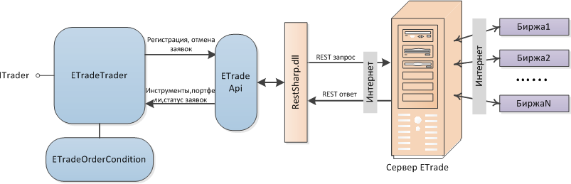
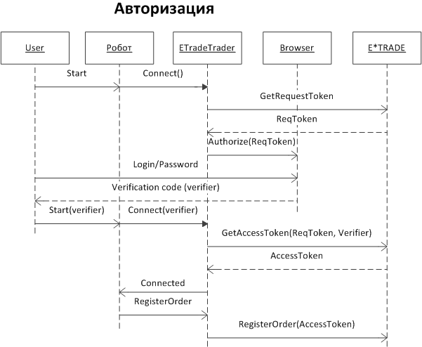

# Настройки коннектора E\*TRADE

При работе с коннектором требуется указать **Логин** и **Пароль** для подключения к торговой площадке. **Логин** и **Пароль** предоставляются брокером. Для получения API доступа рекомендуется обратиться к брокеру.

Механизм взаимодействия показан на рисунке: 

[E\*TRADE](ETrade.md) использует протокол авторизации OAuth 1.0a, требующий ввода логина и пароля на сайте [E\*TRADE](https://etrade.com/) через интернет\-браузер. Последовательность полной процедуры авторизации показана на следующем рисунке:

Полную процедуру авторизации необходимо выполнять только 1 раз в сутки (в полночь по EST сервер [E\*TRADE](ETrade.md) сбрасывает выданные ранее AccessToken’ы). Если в текущий день по EST полная процедура авторизации уже проводилась, [ETradeMessageAdapter](xref:StockSharp.ETrade.ETradeMessageAdapter) автоматически загрузит AccessToken, сохраненный в подкаталоге [E\*TRADE](ETrade.md) робота.
