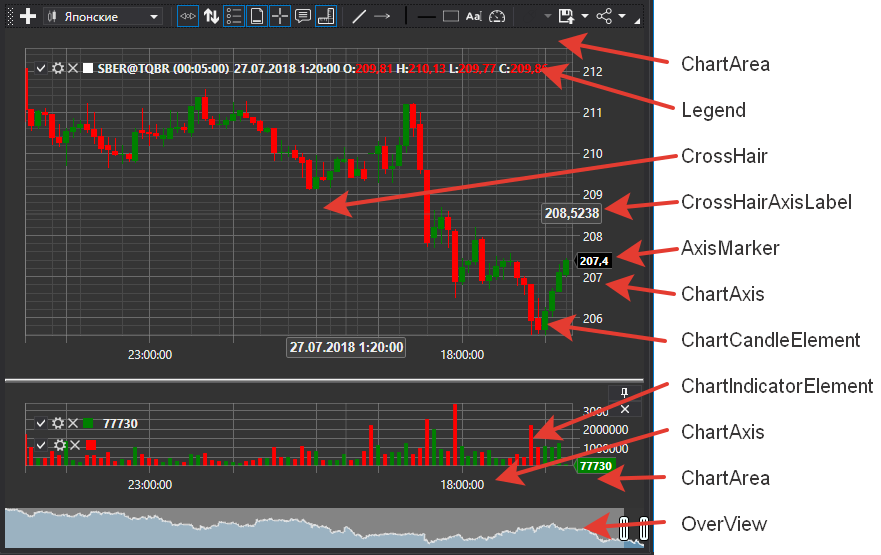

# Графики

[S\#](StockSharpAbout.md) предоставляет удобные компоненты для построения графиков. Эти компоненты собраны в пространстве имен [StockSharp.Xaml.Charting](xref:StockSharp.Xaml.Charting). 

Ключевым понятием в графической библиотеке является понятие *chart*. *Chart* \- это контейнер для других элементов, которые используются при построении графиков. В [S\#](StockSharpAbout.md) имеется несколько типов *чартов*. 

- [Chart](xref:StockSharp.Xaml.Charting.Chart) \- графический компонент для отображения биржевых графиков.
- [ChartPanel](xref:StockSharp.Xaml.Charting.ChartPanel) \- расширенный графический компонент для отображения биржевых графиков.
- [EquityCurveChart](xref:StockSharp.Xaml.Charting.EquityCurveChart) \- графический компонент для отображения кривой доходности.
- [BoxChart](Gui_BoxChart.md) \- график, представляющий объемы в виде сетки цифр.
- [ClusterChart](Gui_ClasterChart.md) \- график, отображающий объемы в виде кластеров с гистограммами.
- [OptionPositionChart](xref:StockSharp.Xaml.Charting.OptionPositionChart) \- графический компонент, показывающий позиции и "греки" опционов относительно базового актива. См. [OptionPositionChart](OptionPositionChart.md).

Кроме того в состав [S\#](StockSharpAbout.md) входят два типа графиков для анализа объемов [BoxChart](Gui_BoxChart.md) и [ClusterChart](Gui_ClasterChart.md). 

На следующем рисунке показаны основные элементы графического компонента. 

### Элементы графического компонента

Элементы графического компонента

### Chart

Chart

[Chart](xref:StockSharp.Xaml.Charting.Chart) является родительским контейнером для других элементов графического контрола. Он содержит методы для добавления и удаления "дочерних" элементов, свойства для настройки внешнего вида компонента и способа отрисовки графиков, а также метод отрисовки самих графиков. *Chart* может содержать несколько областей ([ChartArea](xref:StockSharp.Xaml.Charting.ChartArea)) для построения графиков (см. рисунок). [Chart](xref:StockSharp.Xaml.Charting.Chart) также содержит область предварительного просмотра **OverView** (см. рисунок). В этой области при помощи ползунков можно выбрать зону просмотра графика. Кроме того, можно скроллировать и зуммировать график при помощи перетаскивания области [ChartArea](xref:StockSharp.Xaml.Charting.ChartArea), оси X и при помощи колесика мыши. 

**Основные свойства и методы [Chart](xref:StockSharp.Xaml.Charting.Chart)**

- [Areas](xref:StockSharp.Xaml.Charting.Chart.Areas) \- список областей [ChartArea](xref:StockSharp.Xaml.Charting.ChartArea).
- [ChartTheme](xref:StockSharp.Xaml.Charting.Chart.ChartTheme) \- тема компонента.
- [IndicatorTypes](xref:StockSharp.Xaml.Charting.Chart.IndicatorTypes) \- список индикаторов, которые можно отображать на чарте.
- [CrossHair](xref:StockSharp.Xaml.Charting.Chart.CrossHair) \- включить\/выключить отображение перекрестья.
- [CrossHairAxisLabels](xref:StockSharp.Xaml.Charting.Chart.CrossHairAxisLabels) \- включить\/выключить отображение меток перекрестья на осях.
- [IsAutoRange](xref:StockSharp.Xaml.Charting.Chart.IsAutoRange) \- включить\/выключить автоматическое масштабирование оси X.
- [IsAutoScroll](xref:StockSharp.Xaml.Charting.Chart.IsAutoScroll) \- включить\/выключить автопрокрутку по оси X.
- [ShowLegend](xref:StockSharp.Xaml.Charting.Chart.ShowLegend) \- включить\/выключить отображение легенды.
- [ShowOverview](xref:StockSharp.Xaml.Charting.Chart.ShowOverview) \- включить\/выключить отображение области предпросмотра *OverView*.
- [AddArea](xref:StockSharp.Xaml.Charting.IChart.AddArea) \- добавить [ChartArea](xref:StockSharp.Xaml.Charting.ChartArea).
- [AddElement](xref:Overload:StockSharp.Xaml.Charting.IChart.AddElement) \- добавить элемент серии данных. Имеет несколько перегрузок.
- [Reset](xref:StockSharp.Xaml.Charting.Chart.Reset) \- "сбросить" ранее отрисованные значения.
- [Draw](xref:StockSharp.Xaml.Charting.IChart.Draw) \- отрисовать значение на графике.
- [OrderCreationMode](xref:StockSharp.Xaml.Charting.Chart.OrderCreationMode) \- Режим создания заявок, когда установлен позволяет создавать заявки из графика. По умолчанию выключено.

### ChartArea

ChartArea

[ChartArea](xref:StockSharp.Xaml.Charting.ChartArea) \- область построения графика, является контейнером для элементов [IChartElement](xref:StockSharp.Xaml.Charting.IChartElement) (индикаторы, свечи и т.п.), которые отрисовываются на графике, и осей ([ChartAxis](xref:StockSharp.Xaml.Charting.ChartAxis)) графика. 

**Основные свойства [ChartArea](xref:StockSharp.Xaml.Charting.ChartArea)**

- [Elements](xref:StockSharp.Xaml.Charting.ChartArea.Elements) \- список элементов [IChartElement](xref:StockSharp.Xaml.Charting.IChartElement).
- [XAxises](xref:StockSharp.Xaml.Charting.ChartArea.XAxises) \- список горизонтальных осей.
- [YAxises](xref:StockSharp.Xaml.Charting.ChartArea.YAxises) \- список вертикальных осей.

### IChartElement

IChartElement

Все элементы, которые отображаются на графике должны, реализовывать интерфейс [IChartElement](xref:StockSharp.Xaml.Charting.IChartElement). В [S\#](StockSharpAbout.md) имеются следующие классы, реализующие этот интерфейс: 

- [ChartCandleElement](xref:StockSharp.Xaml.Charting.ChartCandleElement) \- элемент для отображения свечей.
- [ChartIndicatorElement](xref:StockSharp.Xaml.Charting.ChartIndicatorElement) \- элемент для отображения индикаторов.
- [ChartOrderElement](xref:StockSharp.Xaml.Charting.ChartOrderElement) \- элемент для отображения заявок.
- [ChartTradeElement](xref:StockSharp.Xaml.Charting.ChartTradeElement) \- элемент для оторбажения сделок.

Классы визуальных элементов имеют ряд свойств для настройки внешнего вида графика. Можно настроить цвета, толщину линий и стиль элементов. Например, при помощи свойства [ChartCandleElement.DrawStyle](xref:StockSharp.Xaml.Charting.ChartCandleElement.DrawStyle) можно изменять внешний вид свечи (свеча или бар). При помощи свойства [ChartIndicatorElement.DrawStyle](xref:StockSharp.Xaml.Charting.ChartIndicatorElement.DrawStyle) можно установить стиль линии индикатора. Так чтобы отображать индикатор в виде гистограммы нужно использовать значение [ChartIndicatorDrawStyles.Histogram](xref:StockSharp.Xaml.Charting.ChartIndicatorDrawStyles.Histogram). Свойства [ChartCandleElement.ShowAxisMarker](xref:StockSharp.Xaml.Charting.ChartCandleElement.ShowAxisMarker) и [ChartIndicatorElement.ShowAxisMarker](xref:StockSharp.Xaml.Charting.ChartIndicatorElement.ShowAxisMarker) позволяют включать\/выключать отображения маркёров (см. рисунок) на осях графика. 

## См. также

[Свечной график](Gui_Chart.md)

[График\-панель](Gui_ChartPanel.md)

[График эквити](Gui_EquityCurveChart.md)

[Графики box chart](Gui_BoxChart.md)

[Кластеры](Gui_ClasterChart.md)
