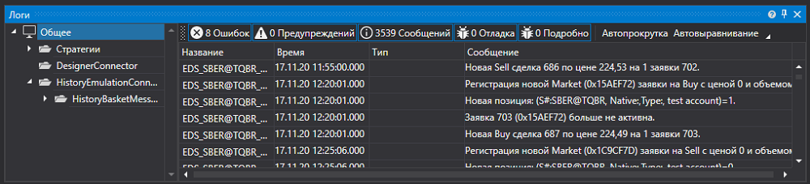

# Расширенная панель логов

[Monitor](xref:StockSharp.Xaml.Monitor) \- визуальный элемент, где [LogControl](GUILogControl.md) используется вместе с иерархическим деревом **TreeView**, в котором отображаются источники логов. Изначально компонент предназначался для мониторинга торговых стратегий. Поэтому по умолчанию в "дереве" присутствует узел **Стратегии**. В тоже время с этим компонетом могут использоваться и другие источники. 



Пример кода

```xaml
<Window x:Class="LoggingControls.MainWindow"
        xmlns="http://schemas.microsoft.com/winfx/2006/xaml/presentation"
        xmlns:x="http://schemas.microsoft.com/winfx/2006/xaml"
        xmlns:sx="clr-namespace:StockSharp.Xaml;assembly=StockSharp.Xaml"
        Title="MainWindow" Height="350" Width="525">
    <Grid>
        <sx:Monitor x:Name="Monitor" />
    </Grid>
</Window>
				
```
```cs
// Создаем LogManager
LogManager _logManager = new LogManager();
// Добавляем источник логов. Используем систему трассировки .NET.
// При работе со стратегиями, добавьте аналогичным образом объект стратегии
_logManager.Sources.Add(new StockSharp.Logging.TraceSource());
// Добавляем "слушателя" логов - GuiLogListener, в конструктор которого передаем ссылку
// на графический элемент.
_logManager.Listeners.Add(new GuiLogListener(Monitor));
                  
```
