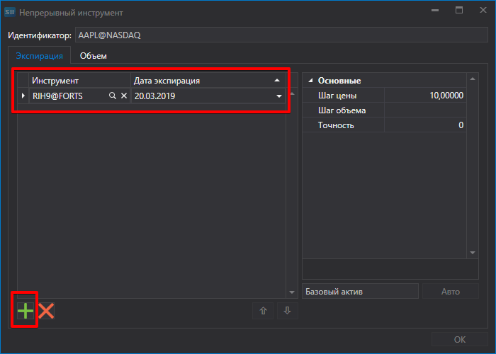

# Непрерывный фьючерс

[ContinuousSecurityWindow](../api/StockSharp.Xaml.ContinuousSecurityWindow.html) \- визуальный редактор для создания *непрерывных* ([ContinuousSecurity](../api/StockSharp.Algo.ContinuousSecurity.html)) инструментов. См. [Непрерывный фьючерс](SecurityContinuous.md). 



Этот компонент включает: 

- Специальное текстовое поле [SecurityIdTextBox](../api/StockSharp.Xaml.SecurityIdTextBox.html) \- генерирует *непрерывный* инструмент при помощи введенного Id \- \[Code\]@\[Board\]. 
- Компонент [SecurityJumpsEditor](../api/StockSharp.Xaml.SecurityJumpsEditor.html) \- специальный DataGrid для работы с инструментами, входящими в состав *непрерывного* инструмента. Составляющие инструменты "обертываются" в класс [SecurityJump](../api/StockSharp.Xaml.SecurityJump.html), который имеет два свойства: [Security](../api/StockSharp.Xaml.SecurityJump.Security.html) и [Date](../api/StockSharp.Xaml.SecurityJump.Date.html) (дата роллирования). Добавленные инструменты хранятся в списке [Jumps](../api/StockSharp.Xaml.SecurityJumpsEditor.Jumps.html). Компонент имеет функцию [Validate](../api/StockSharp.Xaml.SecurityJumpsEditor.Validate.html) для проверки корректности составляющих инструментов. 
- Кнопки добавления\/удаления инструментов. 
- Кнопка **Auto** \- позволяет автоматически создавать *непрерывный* инструмент. 
- Кнопка **Ok** \- завершение создания *непрерывного* инструмента. 

**Основные свойства **

- [Security](../api/StockSharp.Xaml.ContinuousSecurityWindow.Security.html) \- непрерывный инструмент.
- [SecurityStorage](../api/StockSharp.Xaml.ContinuousSecurityWindow.SecurityStorage.html) \- хранилище информации об инструментах. 

Ниже приведен фрагмент кода с его использованием. 

```cs
private void CreateContinuousSecurity\_OnClick(object sender, RoutedEventArgs e)
{
	\_continuousSecurityWindow \= new ContinuousSecurityWindow
	{
		SecurityStorage \= \_entityRegistry.Securities,
		Security \= new ContinuousSecurity { Board \= ExchangeBoard.Associated }
	};
	if (\!\_continuousSecurityWindow.ShowModal(this))
		return;
	\_continuousSecurity \= \_continuousSecurityWindow.Security;
	ContinuousSecurity.Content \= \_continuousSecurity.Id;
	var first \= \_continuousSecurity.InnerSecurities.First();
	var gluingSecurity \= new Security
	{
		Id \= \_continuousSecurity.Id,
		Code \= \_continuousSecurity.Code,
		Board \= ExchangeBoard.Associated,
		Type \= \_continuousSecurity.Type,
		VolumeStep \= first.VolumeStep,
		PriceStep \= first.PriceStep,
		ExtensionInfo \= new Dictionary\<object, object\> { { "GluingSecurity", true } }
	};
	if (\_entityRegistry.Securities.ReadById(gluingSecurity.Id) \=\= null)
	{
		\_entityRegistry.Securities.Save(gluingSecurity);
	}
}
```

## См. также

[Склеивание данных](HydraGluingData.md)
