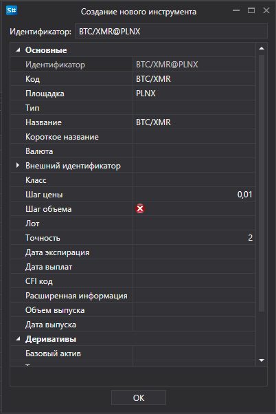

# Создание инструмента

Компонент [SecurityCreateWindow](xref:StockSharp.Xaml.SecurityCreateWindow) \- это окно для создания и редактирования инструмента. Компонент состоит из двух основных элементов: специального текстового поля [SecurityIdTextBox](xref:StockSharp.Xaml.SecurityIdTextBox) и сетки редактирования свойств [PropertyGridEx](xref:StockSharp.Xaml.PropertyGrid.PropertyGridEx). Получить доступ к созданному (отредактированному) инструменту можно при помощи свойства [Security](xref:StockSharp.Xaml.SecurityCreateWindow.Security). 

Ниже показан внешний вид компонента и фрагмент кода с его использованием. 



```cs
private void Button_Click(object sender, RoutedEventArgs e)
{
    var dlg = new SecurityCreateWindow();
    var result = dlg.ShowDialog();
    if (result != null && (bool)result)
    {
        var security = dlg.Security;
    }
}
	
```
