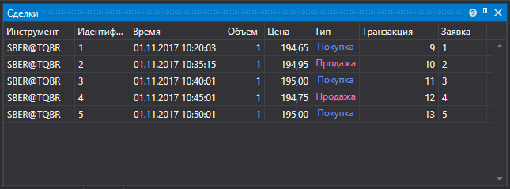

# Собственные сделки

[MyTradeGrid](xref:StockSharp.Xaml.MyTradeGrid) \- таблица для отображения собственных сделок. 



**Основные члены**

- [Trades](xref:StockSharp.Xaml.MyTradeGrid.Trades) \- список сделок.
- [SelectedTrade](xref:StockSharp.Xaml.MyTradeGrid.SelectedTrade) \- выбранная сделка.
- [SelectedTrades](xref:StockSharp.Xaml.MyTradeGrid.SelectedTrades) \- выбранные сделки.

Ниже показаны фрагменты кода с его использованием. Пример кода взят из *Samples\/Common\/SampleConnection*. 

```xaml
<Window x:Class="Sample.MyTradesWindow"
    xmlns="http://schemas.microsoft.com/winfx/2006/xaml/presentation"
    xmlns:x="http://schemas.microsoft.com/winfx/2006/xaml"
    xmlns:loc="clr-namespace:StockSharp.Localization;assembly=StockSharp.Localization"
    xmlns:xaml="http://schemas.stocksharp.com/xaml"
    Title="{x:Static loc:LocalizedStrings.MyTrades}" Height="284" Width="644">
	<xaml:MyTradeGrid x:Name="TradeGrid" x:FieldModifier="public" />
</Window>
	  				
```
```cs
private readonly Connector _connector = new Connector();
private void ConnectClick(object sender, RoutedEventArgs e)
{
        ...............................................
		_connector.NewMyTrade += trade => _myTradesWindow.TradeGrid.Trades.Add(trade);
			
		...............................................
}
	  				
```
