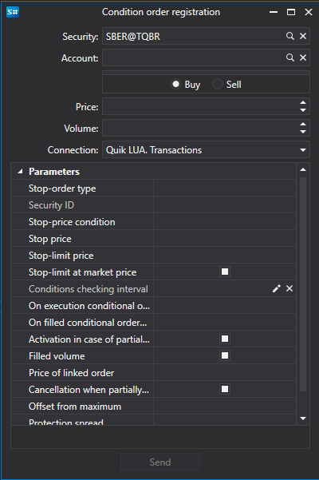

# Ввод стоп\-заявки

> [!TIP]
> Данный контролл устарел, вместо него следует использовать [OrderWindow](xref:StockSharp.Xaml.OrderWindow). Как описано в пункте [Ввод новой заявки](GuiOrderWindow.md).

[OrderConditionalWindow](xref:StockSharp.Xaml.OrderConditionalWindow) \- окно для создания условной заявки. 



**Основные свойства**

- [OrderConditionalWindow.Portfolios](xref:StockSharp.Xaml.OrderConditionalWindow.Portfolios) \- список портфелей. 
- [OrderConditionalWindow.SecurityProvider](xref:StockSharp.Xaml.OrderConditionalWindow.SecurityProvider) \- поставщик информации об инструментах. 
- [OrderConditionalWindow.MarketDataProvider](xref:StockSharp.Xaml.OrderConditionalWindow.MarketDataProvider) \- поставщик рыночных данных. 
- [OrderConditionalWindow.Adapter](xref:StockSharp.Xaml.OrderConditionalWindow.Adapter) \- адаптер сообщений. 
- [OrderConditionalWindow.Order](xref:StockSharp.Xaml.OrderConditionalWindow.Order) \- созданная заявка. 

Ниже показаны фрагменты кода с его использованием. Пример кода взят из *Samples\/Common\/SampleConnection*. 

```cs
...
private readonly Connector _connector = new Connector();
...
private void NewStopOrderClick(object sender, RoutedEventArgs e)
{
	var newOrder = new OrderConditionalWindow
	{
		Order = new Order
		{
			Security = SecurityPicker.SelectedSecurity,
			Type = OrderTypes.Conditional,
			ExpiryDate = DateTime.Today
		},
		SecurityProvider = _connector,
		MarketDataProvider = _connector,
		Portfolios = new PortfolioDataSource(_connector),
		Adapter = _connector.Adapter
	};
	if (newOrder.ShowModal(this))
		_connector.RegisterOrder(newOrder.Order);
}
              		
	  				
```
