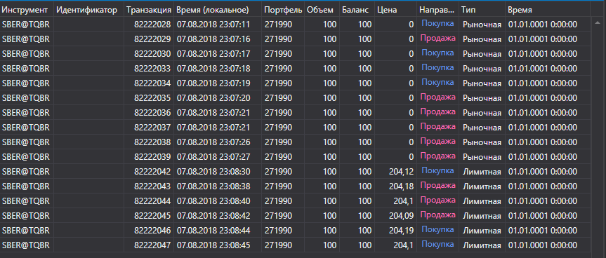

# Лог заявок



[OrderLogGrid](../api/StockSharp.Xaml.OrderLogGrid.html) \- графический компонент для отображения лога заявок ( [OrderLogItem](../api/StockSharp.BusinessEntities.OrderLogItem.html)). 

**Основные свойства и методы**

- [LogItems](../api/StockSharp.Xaml.OrderLogGrid.LogItems.html) \- список элементов лога заявок.
- [SelectedLogItem](../api/StockSharp.Xaml.OrderLogGrid.SelectedLogItem.html) \- выбранный элемент лога заявок.
- [SelectedLogItems](../api/StockSharp.Xaml.OrderLogGrid.SelectedLogItems.html) \- выбранные элементы лога заявок.

Ниже показаны фрагменты кода с его использованием. Пример кода взят из *Samples\/Common\/SampleConnection*. 

```xaml
Window x:Class="SampleITCH.OrdersLogWindow"
        xmlns="http://schemas.microsoft.com/winfx/2006/xaml/presentation"
        xmlns:x="http://schemas.microsoft.com/winfx/2006/xaml"
        xmlns:loc="clr-namespace:StockSharp.Localization;assembly=StockSharp.Localization"
        xmlns:xaml="http://schemas.stocksharp.com/xaml"
        Title="{x:Static loc:LocalizedStrings.OrderLog}" Height="750" Width="900">
	<xaml:OrderLogGrid x:Name="OrderLogGrid" x:FieldModifier="public" />
</Window>
	  				
```
```cs
private readonly Connector _connector = new Connector();
private void ConnectClick(object sender, RoutedEventArgs e)
{
	.................................................
		
	_connector.NewOrderLogItem += _orderLogWindow.OrderLogGrid.LogItems.Add;
	.................................................
}
	  				
```
