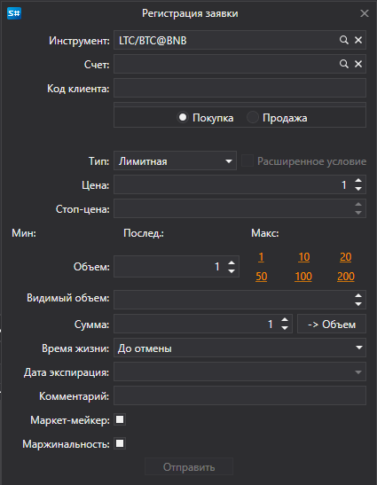

# Ввод новой заявки

[OrderWindow](xref:StockSharp.Xaml.OrderWindow) \- окно для создания заявки. 



Если подключение поддерживает выставление условной заявки (стоп\-лосс, тейк\-профи), то в этом окне можно выставить условную заявку с расширенными условиями установив флаг **Расширенные условия**.

**Основные свойства**

- [Portfolios](xref:StockSharp.Xaml.OrderWindow.Portfolios) \- список портфелей.
- [MarketDataProvider](xref:StockSharp.Xaml.OrderWindow.MarketDataProvider) \- поставщик рыночных данных.
- [SecurityProvider](xref:StockSharp.Xaml.OrderWindow.SecurityProvider) \- поставщик информации об инструментах.
- [Order](xref:StockSharp.Xaml.OrderWindow.Order) \- созданная заявка.

Ниже показаны фрагменты кода с его использованием. Пример кода взят из *Samples\/Common\/SampleConnection*. 

```cs
...
private readonly Connector _connector = new Connector();
...
private void NewOrderClick(object sender, RoutedEventArgs e)
{
	var newOrder = new OrderWindow
	{
		Order = new Order { Security = SecurityPicker.SelectedSecurity },
		SecurityProvider = _connector,
		MarketDataProvider = _connector,
		Portfolios = new PortfolioDataSource(_connector),
	};
	if (newOrder.ShowModal(this))
		_connector.RegisterOrder(newOrder.Order);
}
              		
	  				
```
