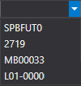

# Выпадающий список портфелей

[PortfolioComboBox](xref:StockSharp.Xaml.PortfolioComboBox) \- комбинированный список для выбора портфеля.



**Основные свойства**

- [PortfolioComboBox.Portfolios](xref:StockSharp.Xaml.PortfolioComboBox.Portfolios) \- список портфелей.
- [PortfolioComboBox.SelectedPortfolio](xref:StockSharp.Xaml.PortfolioComboBox.SelectedPortfolio) \- выбранный портфель.

Ниже показан внешний вид компонента, а также фрагменты кода с его использованием. Пример кода взят из *Samples\/Common\/SampleConnection*. 

```xaml
<Window x:Class="SampleAsyncTransactions.MainWindow"
    xmlns="http://schemas.microsoft.com/winfx/2006/xaml/presentation"
    xmlns:x="http://schemas.microsoft.com/winfx/2006/xaml"
    xmlns:loc="clr-namespace:StockSharp.Localization;assembly=StockSharp.Localization"
    xmlns:sx="clr-namespace:StockSharp.Xaml;assembly=StockSharp.Xaml"
    Title="{x:Static loc:LocalizedStrings.XamlStr567}" Height="116" Width="347">
	<Grid>
		<Grid.ColumnDefinitions>
			..............................
		</Grid.ColumnDefinitions>
		<Grid.RowDefinitions>
			..............................
		</Grid.RowDefinitions>
		<Label Grid.Column="0" Grid.Row="0" Content="{x:Static loc:LocalizedStrings.XamlStr592}" />
		<TextBox x:Name="Path" Text="" Grid.Column="1" Grid.ColumnSpan="2" Grid.Row="0" />
		<Button x:Name="FindPath" Grid.Column="2" Grid.Row="0" Content="..." Width="25" HorizontalAlignment="Left" Click="FindPathClick" />
		<TextBlock Grid.Column="0" Grid.Row="1">
			<Run Text="{x:Static loc:LocalizedStrings.Account}"/><Run Text=":"/>
		</TextBlock>
        <sx:PortfolioComboBox x:Name="Portfolios" Grid.Column="1" Grid.Row="1" />
		<Button x:Name="ConnectBtn" Grid.Column="0" Grid.Row="2" Content="{x:Static loc:LocalizedStrings.Connect}" Click="ConnectClick" />
		<Button x:Name="ShowSecurities" Grid.Column="1" Grid.Row="2" IsEnabled="False" Content="{x:Static loc:LocalizedStrings.Securities}" Click="ShowSecuritiesClick" />
	</Grid>
</Window>
	  				
```
```cs
 .............................................
 private readonly Connector _connector = new Connector();
 .............................................
private void ConnectClick(object sender, RoutedEventArgs e)
{
	.............................................
	Portfolios.Portfolios = new PortfolioDataSource(_connector);	
	.............................................
}
	  				
```
