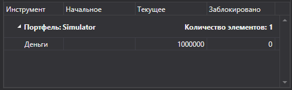

# Таблица портфелей

[PortfolioGrid](../api/StockSharp.Xaml.PortfolioGrid.html) \- компонент, отображающий состояние портфелей и позиций. 



**Основные свойства**

- [Portfolios](../api/StockSharp.Xaml.PortfolioGrid.Portfolios.html) \- список портфелей.
- [Positions](../api/StockSharp.Xaml.PortfolioGrid.Positions.html) \- список позиций.
- [SelectedPosition](../api/StockSharp.Xaml.PortfolioGrid.SelectedPosition.html) \- выбранная позиция.
- [SelectedPositions](../api/StockSharp.Xaml.PortfolioGrid.SelectedPositions.html) \- выбранные позиции.

Ниже показан внеший вид компонента, а также фрагменты кода с его использованием. Пример кода взят из *Samples\/Common\/SampleConnection*. 

```xaml
\<Window x:Class\="Sample.PortfoliosWindow"
        xmlns\="http:\/\/schemas.microsoft.com\/winfx\/2006\/xaml\/presentation"
        xmlns:x\="http:\/\/schemas.microsoft.com\/winfx\/2006\/xaml"
        xmlns:loc\="clr\-namespace:StockSharp.Localization;assembly\=StockSharp.Localization"
        xmlns:xaml\="http:\/\/schemas.stocksharp.com\/xaml"
        Title\="{x:Static loc:LocalizedStrings.Portfolios}" Height\="200" Width\="470"\>
	\<xaml:PortfolioGrid x:Name\="PortfolioGrid" x:FieldModifier\="public" \/\>
\<\/Window\>
	  				
```
```cs
				  
private readonly Connector \_connector \= new Connector();
private void ConnectClick(object sender, RoutedEventArgs e)
{
	.........................................................				
	\_connector.NewPortfolio +\= portfolio \=\> \_portfoliosWindow.PortfolioGrid.Portfolios.Add(portfolio);
	\_connector.NewPosition +\= position \=\> \_portfoliosWindow.PortfolioGrid.Positions.Add(position);
	.........................................................
}
	  				
```
