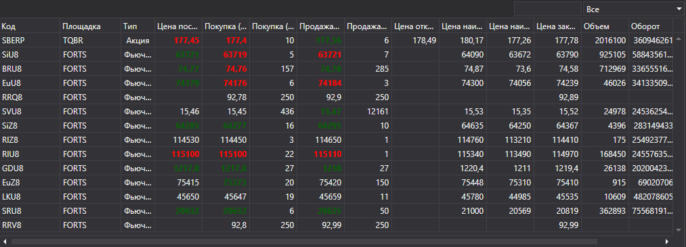

# Инструменты

Компонент [SecurityGrid](../api/StockSharp.Xaml.SecurityGrid.html) предназначен для отображения финансовой информации (поля level1) и ее изменения, относящейся к инструментам, в табличном виде. Компонент позволяет выбирать один или несколько инструментов. 



**Основные свойства**

- [Securities](../api/StockSharp.Xaml.SecurityGrid.Securities.html) \- список инструментов.
- [SelectedSecurity](../api/StockSharp.Xaml.SecurityGrid.SelectedSecurity.html) \- выбранный инструмент.
- [SelectedSecurities](../api/StockSharp.Xaml.SecurityGrid.SelectedSecurities.html) \- список выбранных инструментов.
- [MarketDataProvider](../api/StockSharp.Xaml.SecurityGrid.MarketDataProvider.html) \- провайдер рыночных данных.

Обратите внимание, что для отображения изменений рыночной информации необходимо задать провайдер рыночных данных. 

Ниже показаны внешний вид компонента и фрагмент кода с его использованием. 

На рисунке компонент [SecurityGrid](../api/StockSharp.Xaml.SecurityGrid.html) показан в составе графического компонента [SecurityPicker](GuiSecurityPicker.md). 

```xaml
\<Window x:Class\="SecurityGridSample.MainWindow"
        xmlns\="http:\/\/schemas.microsoft.com\/winfx\/2006\/xaml\/presentation"
        xmlns:x\="http:\/\/schemas.microsoft.com\/winfx\/2006\/xaml"
        xmlns:sx\="clr\-namespace:StockSharp.Xaml;assembly\=StockSharp.Xaml"
        Title\="MainWindow" Height\="350" Width\="525"\>
    \<Grid\>
        \<sx:SecurityGrid x:Name\="SecurityGrid"\/\>
    \<\/Grid\>
\<\/Window\>
	  				
```
```cs
private readonly Connector \_connector \= new Connector();
\/\/ Назначаем провайдер рыночных данных
SecurityGrid.MarketDataProvider \= \_connector;
..........................
\/\/ Добавляем в сетку инструменты
\_connector.NewSecurity +\= security \=\>
{
	SecurityGrid.Securities.Add(security);
};
..........................
\/\/ Здесь показано, как можно изменить видимость колонок в сетке
private void ColumnsFilter()
{
	\/\/ Задаем список видимых колонок
	string\[\] columns \= { "Board", "BestAsk.Price", "BestAsk.Volume" };
	
	foreach (var column in SecurityGrid.Columns)
	{
		column.Visibility \= columns.Contains(column.SortMemberPath) ? Visibility.Visible : Visibility.Collapsed;
	}
}
              
```
