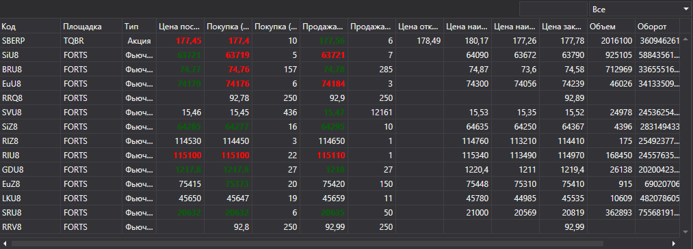

# Выбор инструмента

Компонент [SecurityPicker](xref:StockSharp.Xaml.SecurityPicker) предназначен для поиска и выбора инструментов. Поддерживается как одиночный, так и множественный выбор. Компонент позволяет фильтровать список инструментов по их типу. Также этот компонент может использоваться для отображения финансовой информации (полей level1), как показано в разделе [SecurityGrid](GuiSecurityGrid.md). 



[SecurityPicker](xref:StockSharp.Xaml.SecurityPicker) состоит из: 

1. Текстового поля, для ввода кода (или Id) инструмента. При вводе выполняется фильтрация списка по введенной подстроке.
2. Специального комбинированного списка [SecurityTypeComboBox](xref:StockSharp.Xaml.SecurityTypeComboBox) для фильтрации инструментов по их типу.
3. Таблицы [SecurityGrid](xref:StockSharp.Xaml.SecurityGrid) для отображения списка инструментов.

**Основные свойства**

- [SelectionMode](xref:StockSharp.Xaml.SecurityPicker.SelectionMode) \- режим выбора инструмента: одиночный, множественный.
- [ShowCommonStatColumns](xref:StockSharp.Xaml.SecurityPicker.ShowCommonStatColumns) \- отображать основные колонки.
- [ShowCommonOptionColumns](xref:StockSharp.Xaml.SecurityPicker.ShowCommonOptionColumns) \- отображать основные колонки для опционов.
- [Title](xref:StockSharp.Xaml.SecurityPicker.Title) \- заголовок, который отображается в верхней части компонента.
- [Securities](xref:StockSharp.Xaml.SecurityPicker.Securities) \- список инструментов.
- [SelectedSecurity](xref:StockSharp.Xaml.SecurityPicker.SelectedSecurity) \- выбранный инструмент.
- [SelectedSecurities](xref:StockSharp.Xaml.SecurityPicker.SelectedSecurities) \- список выбранных инструментов.
- [FilteredSecurities](xref:StockSharp.Xaml.SecurityPicker.FilteredSecurities) \- список отфильтрованных инструментов.
- [ExcludeSecurities](xref:StockSharp.Xaml.SecurityPicker.ExcludeSecurities) \- список скрытых в списке инструментов.
- [SelectedType](xref:StockSharp.Xaml.SecurityPicker.SelectedType) \- выбранный тип инструмента.
- [SecurityProvider](xref:StockSharp.Xaml.SecurityPicker.SecurityProvider) \- провайдер информации об инструментах.
- [MarketDataProvider](xref:StockSharp.Xaml.SecurityPicker.MarketDataProvider) \- провайдер рыночных данных.

Ниже показан фрагмент кода с его использованием, взятый из примера *Samples\/Common\/SampleConnection*: 

```xaml
<Window x:Class="Sample.SecuritiesWindow"
    xmlns="http://schemas.microsoft.com/winfx/2006/xaml/presentation"
    xmlns:x="http://schemas.microsoft.com/winfx/2006/xaml"
    xmlns:loc="clr-namespace:StockSharp.Localization;assembly=StockSharp.Localization"
    xmlns:xaml="http://schemas.stocksharp.com/xaml"
    Title="{x:Static loc:LocalizedStrings.Securities}" Height="415" Width="1081">
	<Grid>
		<Grid.RowDefinitions>
			<RowDefinition Height="*" />
			<RowDefinition Height="Auto" />
		</Grid.RowDefinitions>
		<xaml:SecurityPicker x:Name="SecurityPicker" x:FieldModifier="public" SecuritySelected="SecurityPicker_OnSecuritySelected" ShowCommonStatColumns="True" />
	</Grid>
</Window>
	  	
```
```cs
private void ConnectClick(object sender, RoutedEventArgs e)
{
    ......................................
	_connector.NewSecurity += security => _securitiesWindow.SecurityPicker.Securities.Add(security);
	// устанавливаем поставщик маркет-данных
	_securitiesWindow.SecurityPicker.MarketDataProvider = _connector;
	......................................
}
private void SecurityPicker_OnSecuritySelected(Security security)
{
	NewStopOrder.IsEnabled = NewOrder.IsEnabled =
	Level1.IsEnabled = Depth.IsEnabled = security != null;
}
```
