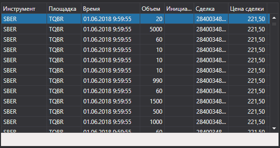

# Тиковые сделки



[TradeGrid](xref:StockSharp.Xaml.TradeGrid) \- таблица сделок. 

**Основные свойства**

- [Trades](xref:StockSharp.Xaml.TradeGrid.Trades) \- список сделок.
- [SelectedTrade](xref:StockSharp.Xaml.TradeGrid.SelectedTrade) \- выбранная сделка.
- [SelectedTrades](xref:StockSharp.Xaml.TradeGrid.SelectedTrades) \- выбранные сделки.

Ниже показаны фрагменты кода с его использованием. Пример кода взят из *Samples\/Common\/SampleConnection*. 

```xaml
<Window x:Class="Sample.TradesWindow"
    xmlns="http://schemas.microsoft.com/winfx/2006/xaml/presentation"
    xmlns:x="http://schemas.microsoft.com/winfx/2006/xaml"
    xmlns:loc="clr-namespace:StockSharp.Localization;assembly=StockSharp.Localization"
    xmlns:xaml="http://schemas.stocksharp.com/xaml"
    Title="{x:Static loc:LocalizedStrings.Str985}" Height="284" Width="544">
	<xaml:TradeGrid x:Name="TradeGrid" x:FieldModifier="public" />
</Window>
	  				
```
```cs
private void ConnectClick(object sender, RoutedEventArgs e)
{
	.......................................
	// Добавляем свои сделки в таблицу MyTradeGrid
	_connector.NewMyTrade += trade => _myTradesWindow.TradeGrid.Trades.Add(trade);
	
	// Добавляем сделки в таблицу TradeGrid
	_connector.NewTrade += trade => _tradesWindow.TradeGrid.Trades.Add(trade);
	.......................................
}            		
	  				
```
