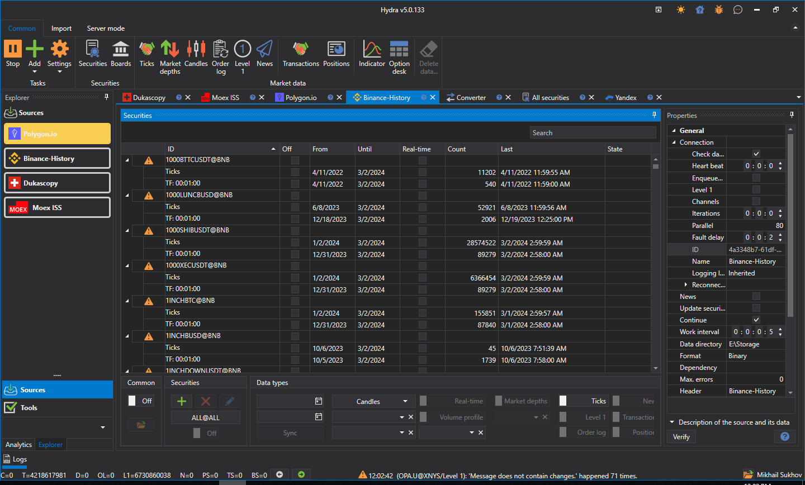

# S\#.Data (Hydra)

Программа [S\#.Data](Hydra.md) (кодовое название Hydra) предназначена для автоматической загрузки маркет\-данных (инструменты, свечи, тиковые сделки и стаканы) из различных источников и хранения их в локальном хранилище. Данные могут сохраняются в двух форматах: в специальном бинарном формате [S\#.Data](Hydra.md) (BIN), что обеспечивает максимальную степень сжатия, или в текстовом формате CSV, что удобно при анализе данных в других программах. В дальнейшем сохраненная информация доступна для использования торговыми стратегиями (подробнее, о тестировании стратегий написано в разделе [Тестирование](StrategyTesting.md)). Доступ к данным можно получить напрямую, через использование [StorageRegistry](xref:StockSharp.Algo.Storages.StorageRegistry) (подробнее, написано в разделе [Хранение данных](Storages.md)), или через обычные выгрузки в так форматы, как [Excel](https://ru.wikipedia.org/wiki/Excel), xml или txt (подробнее, в разделе [Установка и работа](HydraUsing.md)). 

Одновременно, [S\#.Data](Hydra.md) может использовать источники как исторических, так и данных реального времени (например, подключение к [Quik](Quik.md) или [SmartCOM](Smart.md) для получения стаканов). Это возможно за счет использования расширяемой (плагинной) модели источников. 

Плагинная модель позволяет разрабатывать собственные источники. О разработке собственных источников и установке их в программу [S\#.Data](Hydra.md), написано в разделе [Создание источника](HydraPlugins.md). 
