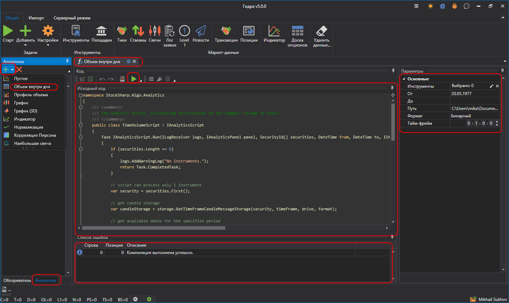
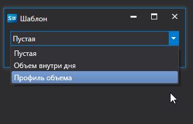

# Работа со скриптами

- После нажатия на кнопку **Аналитика**.
- Появится окно с выбором готового шаблона для редактирования его в редакторе [Hydra](Hydra.md). После чего нужно нажать **ОК**.
- После этого будет загружен скрипт выбранного шаблона.

  ВАЖНО\!Используемый скрипт должен быть классом, унаследованным от класса *BaseAnalyticsStrategy*.
- Для [запуска](HydraAnalyticsShow.md) аналитики необходимо нажать кнопку **Старт** . 
- Для подключения нужных библиотек используется кнопка **Ссылки** .

> [!TIP]
> В стандартную поставку [Hydra](Hydra.md) входят два готовых скрипта: **"Объем внутри дня"** и **"Профиль объема"**.
