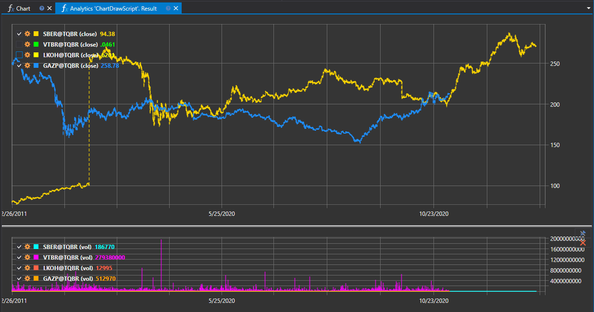

# Запуск и отображение результатов анализа

Ниже описана последовательность действий для проведения анализа данных.

### Запуск скрипта и отображение результатов анализа на примере инструмента SBER@TQBR:

Для примера мы [выбираем шаблон](HydraAnalyticsScripts.md)**"Объем внутри дня"**.

1. Выбираем данные для анализа:
   - В окне **Параметры** расположенной в правой части программы.
   - Устанавливаем инструмент, в нашем случае SBER@TQBR. Начальную и конечную дату, путь к данным и их формат.
2. Запускаем скрипт при помощи кнопки .
3. После чего отобразиться результат обработки.. 
4. Просмотреть результаты:

   По умолчанию результат формируется ввиде таблицы. Для просмотра полученных данныхв виде графиков, необходимо выбрать один из нескольких вариантов вывода данных.

   После чего будет построен выбранный график по результатам процесса аналитики.
