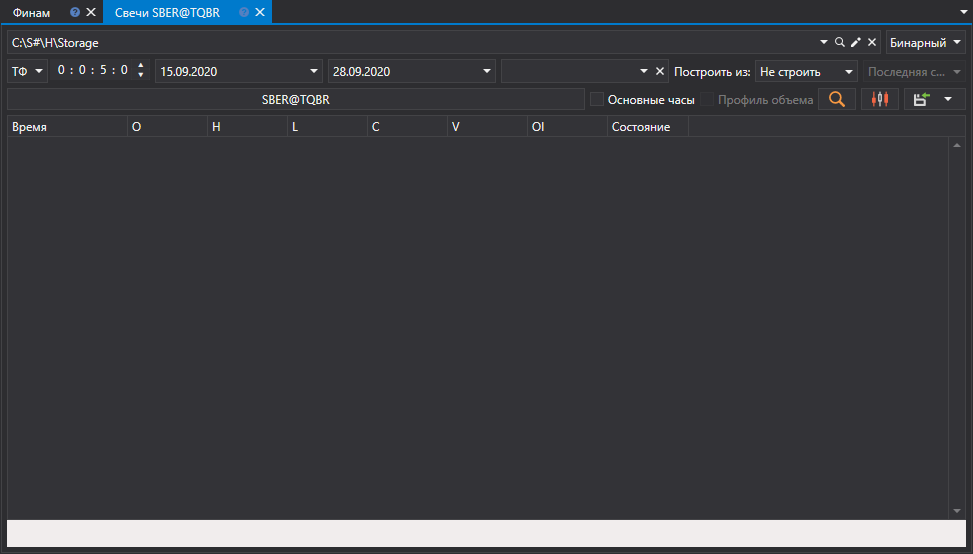
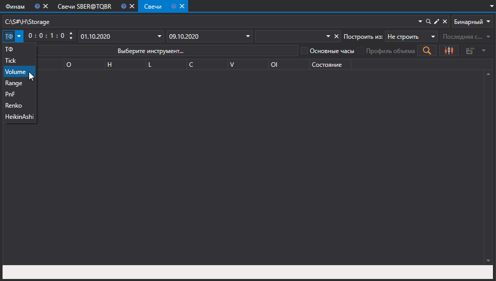
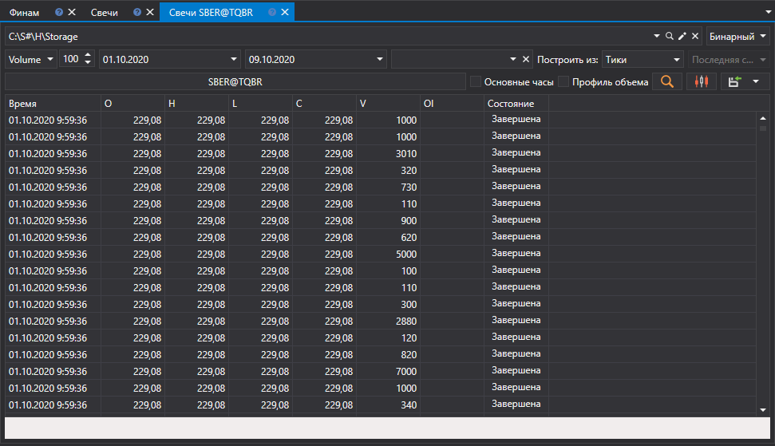
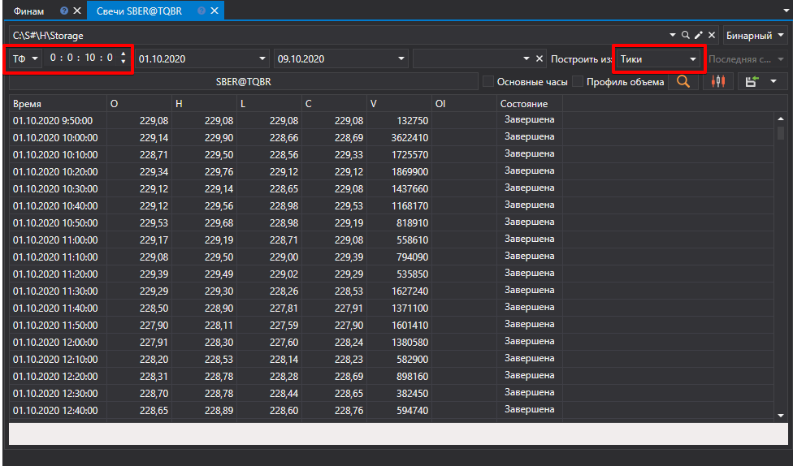
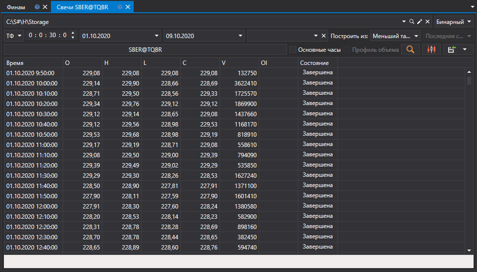
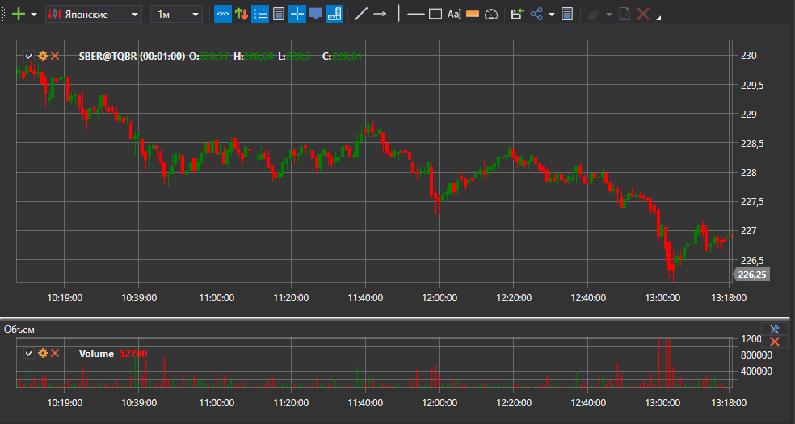
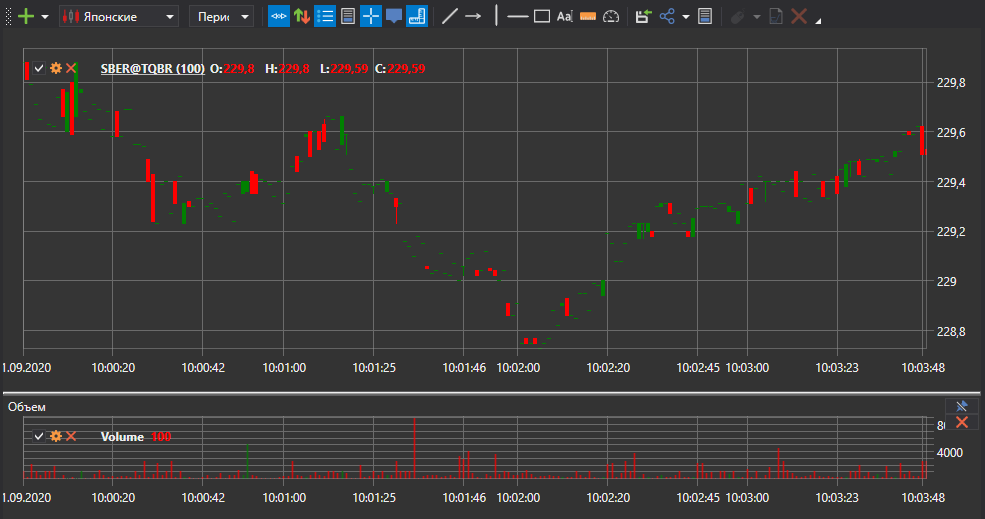
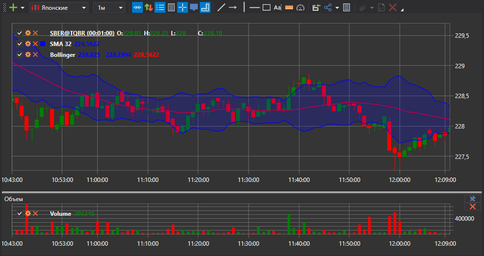

# Генерация свечек

[S\#.Data](Hydra.md) позволяет на основе скачанных сделок формировать свечи, которые в последствии можно экспортировать в форматы [Excel](https://ru.wikipedia.org/wiki/Excel), xml, sql, bin, Json или txt (cм. ниже).

Это позволяет в последствии использовать данные в любых программах теханализа (WealthLab, AmiBroker и т.д.).

### Генерация свечей

Генерация свечей

1. На вкладке **Общее** нажать кнопку **Свечи**, откроется следующее окно:

   
2. Далее необходимо: 
   - Выбрать из выпадающего списка интересующий тип свечи (поддерживаются все [стандартные свечи](Candles.md))
   - Выбрать нужный **Тайм Фрейм**.

     Для примера нами выбраны свечи с Тайс Фреймом 5 мин.
   - Выбрать инструмент (в нашем случае это SBER@TQBR) и нажать на кнопку 

   После этого произойдет генерация свечей на основе найденных данных. Например, для свечей типа [TimeFrameCandle](../api/StockSharp.Algo.Candles.TimeFrameCandle.html) будет сформировано следующее:

   

   Если есть потребность построить свечи другого типа, например [VolumeCandle](../api/StockSharp.Algo.Candles.VolumeCandle.html) нужно сделать следующее: 
   - Выбрать тип свечи. 

     
   - Выбрать период объем.
   - Установить инструмент.
   - Выбрать в **Построить из**, например, **Тики**. Нажать на кнопку 

     

   Если маркет\-данные не удалось получить из источника, можно сгенерировать свечи выбрав в поле ["Построить из"](HydraUsingDifferentTypesMarketData.md) тип данных из которых они будут построены.

   Например:
   - Свечи с Тайм Фреймом 10 мин из Тиков. 

     
   - Можно построить свечи с большим Тайм Фреймом из свечей с меньшим, выбрав в **Построить из** построить **Меньший Тайм Фрейм**. Например из свечей с Тайм Фреймом 5 минут свечи с Тайм Фреймом 30 мин.

     

   > [!TIP]
   > Если в **Построить из:** выбрать **не строить**, то будет произведен поиск готовых свечей, которые были скачаны через источник.
3. Если необходимо графически посмотреть сгенерированные свечи, то нужно нажать на кнопку  и после этого откроется график:

   

   
4. К графику можно добавить индикаторы. Для этого нужно открыть контекстное меню, щелкнув правой кнопкой по панели графика, и выбрать пункт **Индикатор**. Кроме того, индикатор можно вывести на отдельной панели. Для этого необходимо добавить новую панель при помощи кнопки  и также выбрать необходимый индикатор из контекстного меню.

   
5. Полученные значения можно [экспортировать в нужный формат](HydraExport.md).

**Смотреть [видеоинструкцию](HydraBuildDifferentCandleType.md)**
