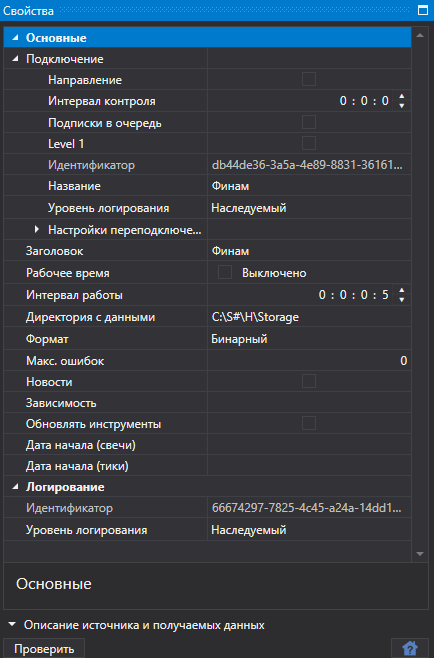

# Общие параметры подключения

Свойства подключения, которые общие для всех источников.

**Подключение**

- **Подключение**

   \- Настройки подключения
- **Заголовок**

   \- Заголовок задачи.
- **Дата начала (тики)**

   \- С какой даты начать скачивать данные.
- **Работать с**

   \- Время начала работы.
- **Работать до**

   \- Время окончания работы.
- **Интервал работы**

   \- Интервал работы.
- **Директория с данными**

   \- Директория с данными, куда будут сохраняться конечные файлы в формате StockSharp.
- **Формат**

   \- Формат данных: BIN\/CSV.
- **Макс, ошибок**

   \- Максимальное количество ошибок, после которого задача будет остановлена. По умолчанию равно 0, что означает игнорирование количества ошибок.
- **Новости**

   \- Скачивать новости.
- **Зависимость**

   \- Задача, которая должна быть выполнена перед запуском текущей.
- **Обновлять инструменты**

   \- Обновлять инструменты при подключении.
