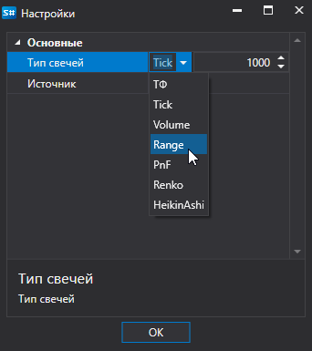
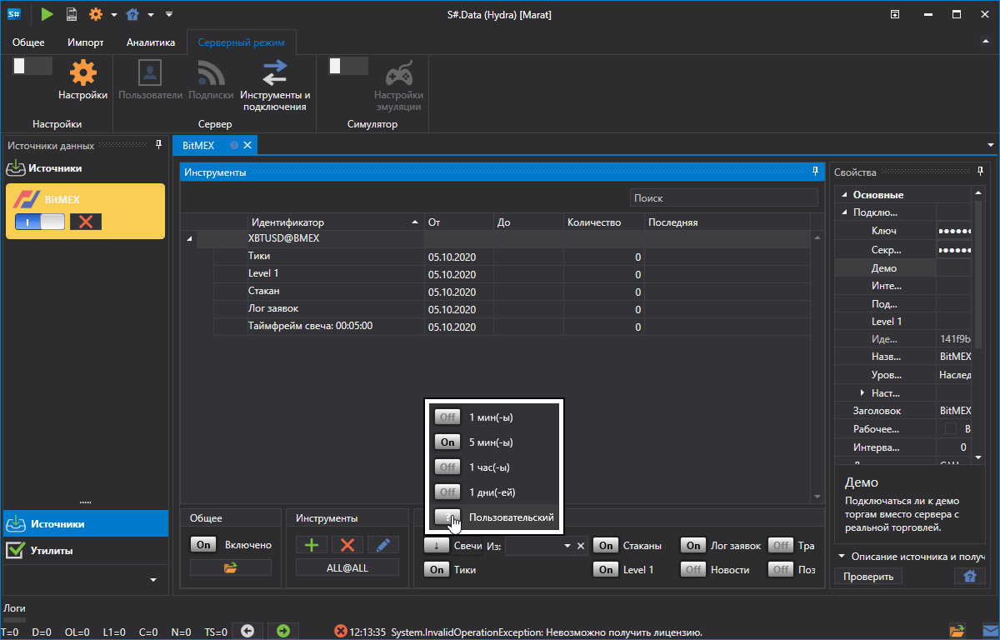
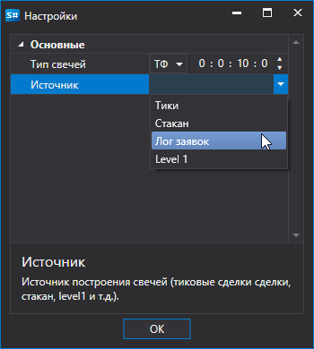
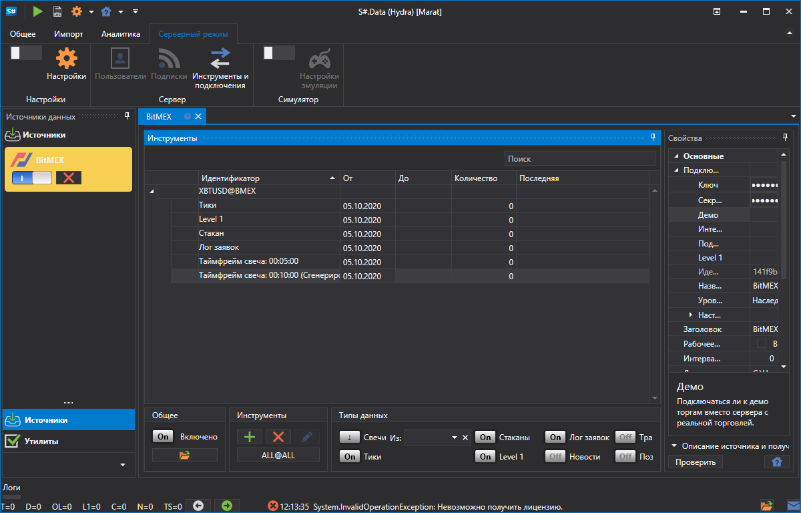
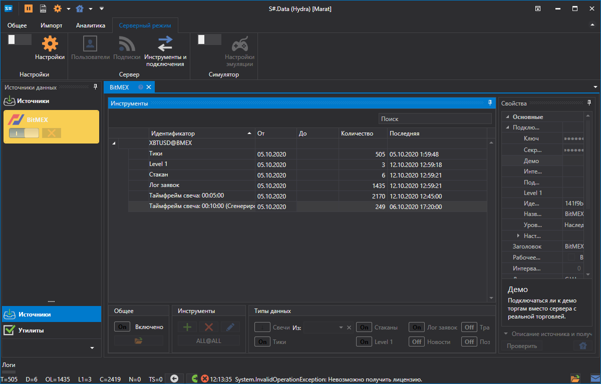
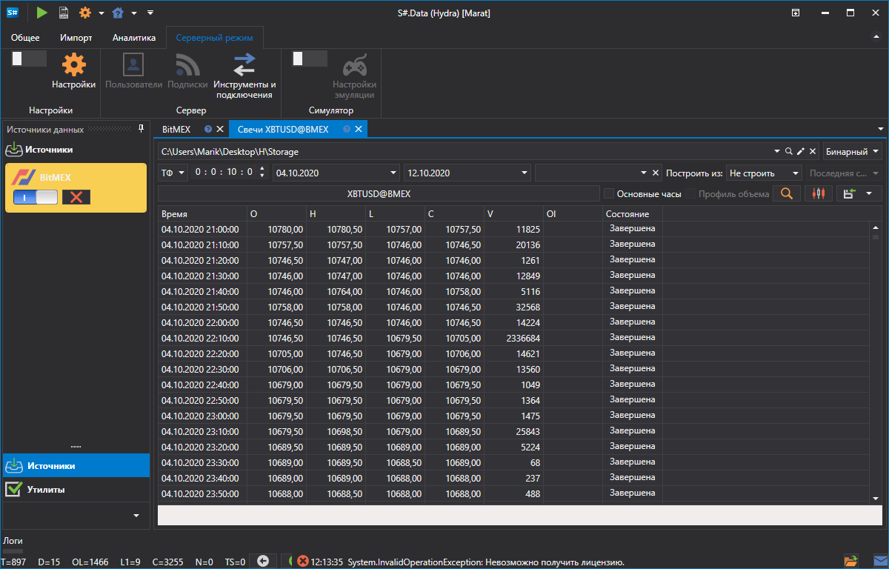
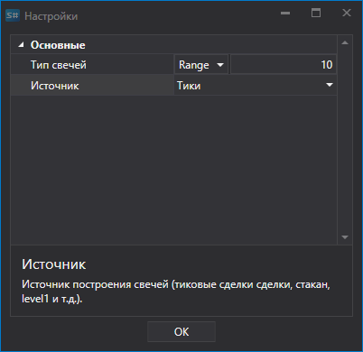
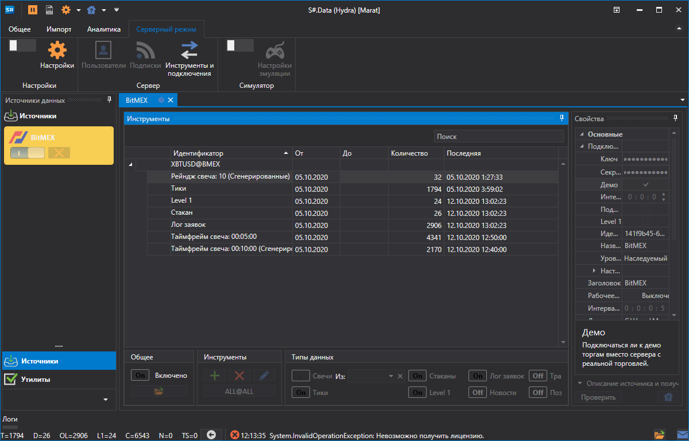
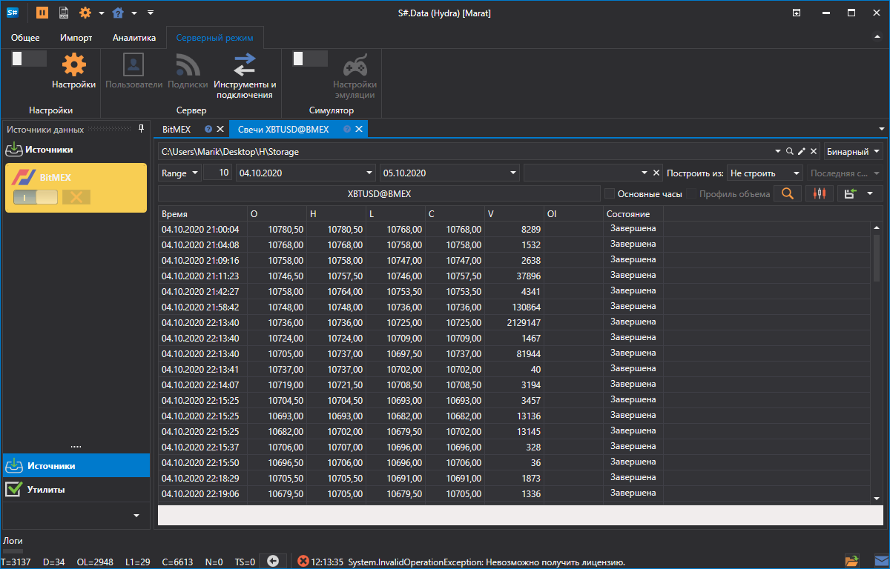

# Настройка пользовательских свечей

Пользователь может выбрать **Пользовательский** тип свечей и самостоятельно выбрать какие свечи будут построены. при этом свечи будут строяться "на лету", тоесть сразу.

Раасмотрим пример такого построения. Биржа **Bitmex** не дает возможности получить свечи с Тайм Фреймом 10 мин.

Последовательность получения таких свечей:

1. Выбираем **Пользовательские** свечи.
2. В настройках указываем свечи **ТФ** и период 10 мин.
3. В источнике указываем из чего будут строяться свечи \- **Лог заявок**

   
4. Устанавливаем период. Как видно рядом с названием свечи появилось указание **Сгенерированные**.

   
5. Нажимаем на запуск и данные начинают скачиваться.

   
6. Перейдем в раздел свечи и [посмотрим скаченные данные](HydraViewingMarketData.md).

   

Как видно данные успешно получены.

Рассмотрим пример, когда нам необходимо получить [RangeCandle](xref:StockSharp.Algo.Candles.RangeCandle):

1. Выбираем **Пользовательские** свечи.
2. В настройках указываем свечи **Range** и объем 10.
3. В источнике указываем из чего будут строяться свечи \- **Тики**

   
4. Устанавливаем период.
5. Нажимаем на запуск и данные начинают скачиваться.

   
6. Перейдем в раздел свечи и [посмотрим скаченные данные](HydraViewingMarketData.md).

   
