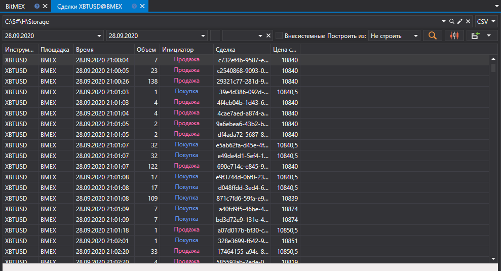

# Сделки (Тики)

В появившимся окне выбрать интересуемый диапазон времени, выбрать инструмент и нажать кнопку :

Для выгрузки внесистемных сделок, необхщдимо установить галочку в поле **Внесистемные**.

Полученные значения можно [экспортировать в нужный формат](HydraExport.md).
