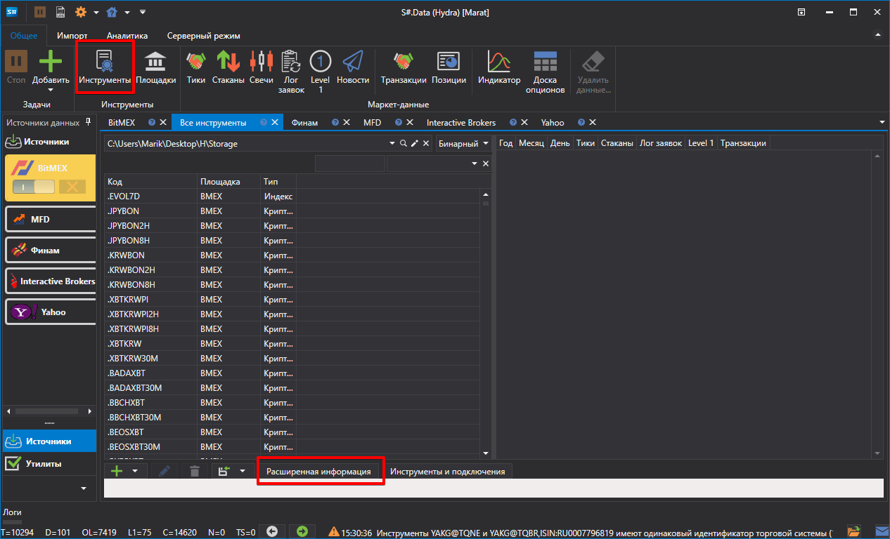
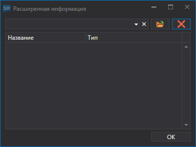
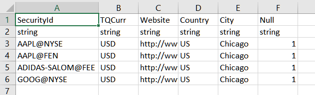
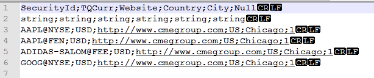

# Расширенная информация

Источниками расширенной информации по инструментам являются **CSV** файлы, расположенные в папке "c:\\Users\\Users\\Documents\\StockSharp\\Hydra\\Extended info\\", которые автоматически загружаются при загрузке [S\#.Data](Hydra.md).

Расширенной информацией может являться любая необходимая информация по инструменту (например, страна, город, сайт и др.). 

Каждый источник расширенной информации (**CSV** файл) содержит список инструментов и свойств расширенной информации имеющихся в источнике для каждого из инструментов. Для каждого источника расширенной информации, расширенная информация будет уникальной.

Если в источнике нет расширенной информации по инструменту, то в колонках соответствующих расширенной информации, списка всех инструментов, будут отображаться пустые ячейки.

Для выбора необходимой расширенной информации, нужно:

1. во вкладке инструменты нажать на кнопку **Расширенная информация**

   
2. После чего появиться окно, в котром необходимо выбрать путь к нужному CSV файлу.

   

Ниже представлен пример **CSV** файла расширенной информации открытый в разных редакторах **MS Excel** и **NotePad**

## См. также
