# Первый запуск

### При первом запуске будет показано следующее окно:

При первом запуске будет показано следующее окно:

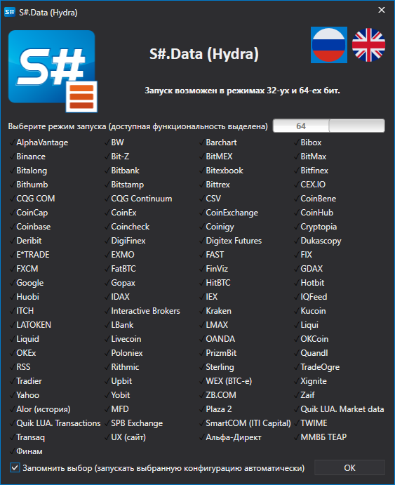

Необходимо выбрать режим запуска и нажать кнопку **ОК**.

После чего появится окно выбора источников данных. Также это окно можно открыть со вкладки **Общее**, нужно выбрать **Добавить \=\> Источники**. 

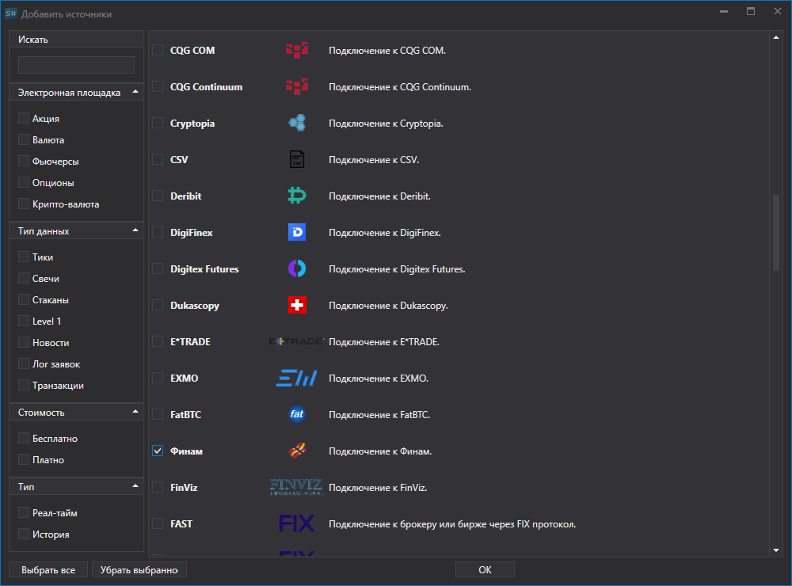

В окне отметте нужные источники. Можно воспользоваться фильтрами по региону, электронной площадке, типу данных, платности, реал\-тайм или нет. По завершении выбора нажмите кнопку **OK**. После чего программа предложит включить утилиты. Подробнее работа с утилитами описана в разделе [Утилиты](HydraTasks.md). Нажимаем **OK**.

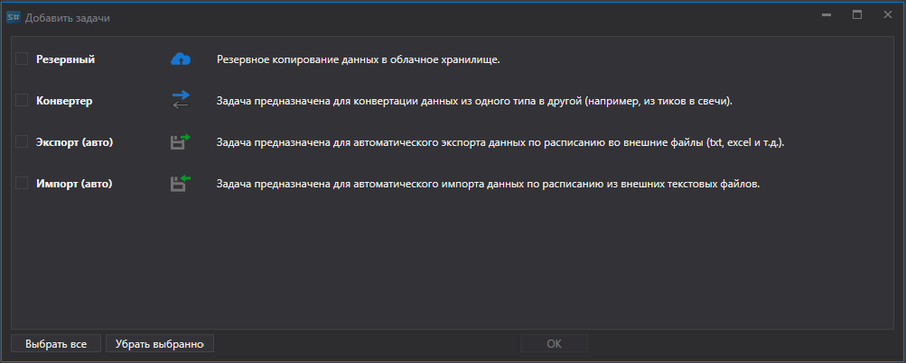

После этого источники будут добавлены на левую панель главного окна приложения. 

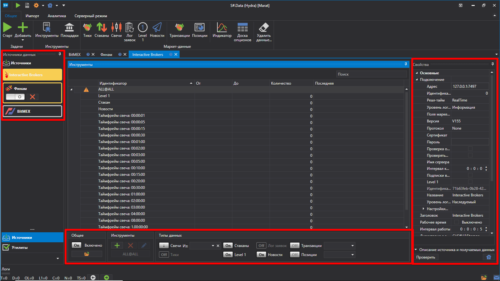

### Скачивание инструмента для загрузки маркет\-данных:

Скачивание инструмента для загрузки маркет\-данных:

Перед началом скачивания маркет\-данных необходимо настроить инструменты, по которым необходимо получить маркет\-данные.

После добавления источников маркет\-данных, в центральной части будут открыты панели добавленных источников, где отображается список инструментов. Если панель закрыта, то для открытия необходимо дважды кликнуть на логотип источника в списке в левой части программы.

Для примера скачаем инструмент SBER@TQBR (акции ПАО "Сбер")по источнику ФИНАМ. 

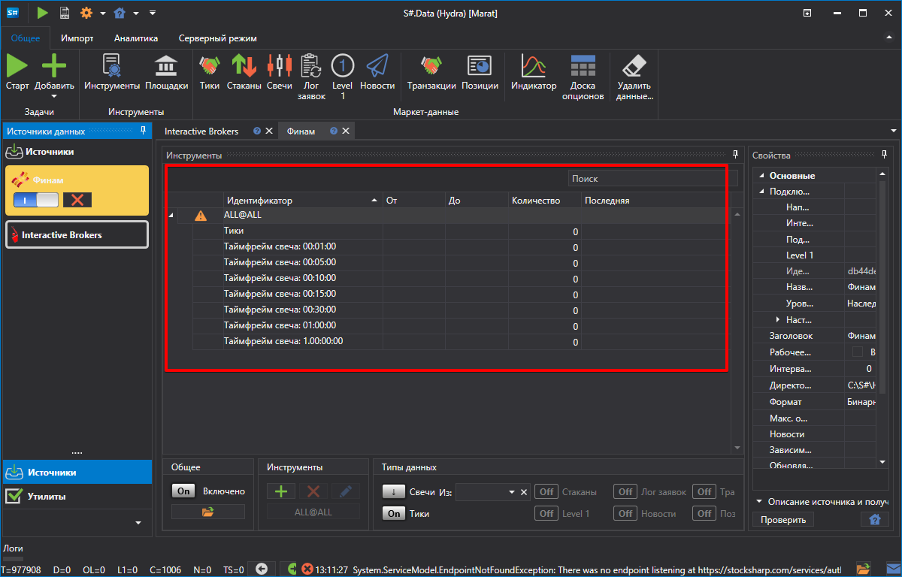

> [!TIP]
> ВАЖНО\! Скачивание данных идет только по добавленным инструментам в список инструментов.

1. Добавляем инструменты.

   При первом запуске программа предложит скачать сразу все инструменты по выбранному источнику. В дальнейшем, пользователь будет скачивать инструменты самостоятельно. Первоначально база данных инструментов в [S\#.Data](Hydra.md) пуста, есть только вспомогательный инструмент **ALL@ALL**. При выборе данного инструмента будут скачиваться данные по всем доступным для данного источника инструментам. 

   Для добавления инструмента щелкаем на кнопку **Добавить**. После чего откроется окно для скачивания инструментов.

   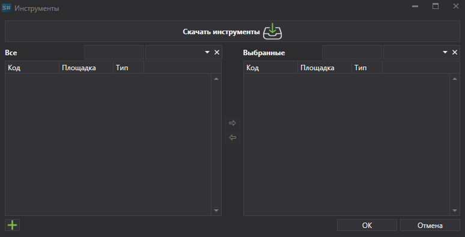

   Для скачивания инструментов необходимо нажать соответствующую кнопку **Скачать инструмент**.

   После этого на экране появится меню, в котором пользователь может выбрать **Скачать все инструменты**.

   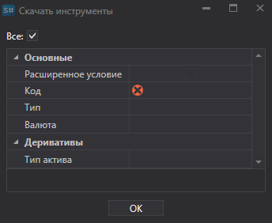

   Или, для ряда источников, [настроить](HydraConfigurationSecuritiesDownload.md) нужные для скачивания инструменты.

   После того, как инструменты будут получены, окно примет следующий вид.

   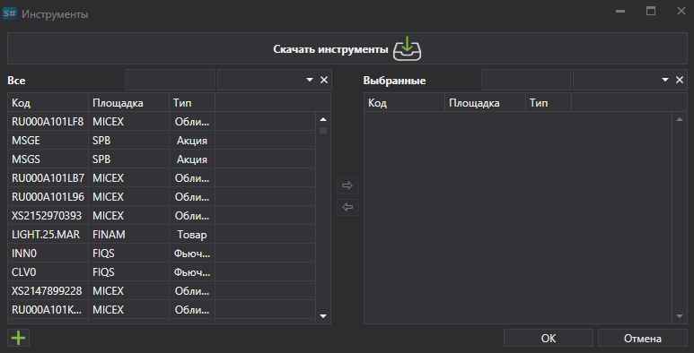

   В нём будут видны все доступные для добавления инструменты. Для быстрого поиска можно ввести его название в соответсвующее поле.

   Для выбора инструмента необходимо два раза щелкнуть на нем и он переместится в правую часть списка.

   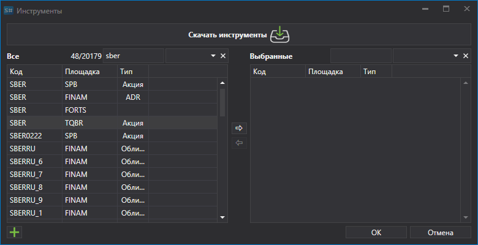

   После чего он переместится в правую часть таблицы.

   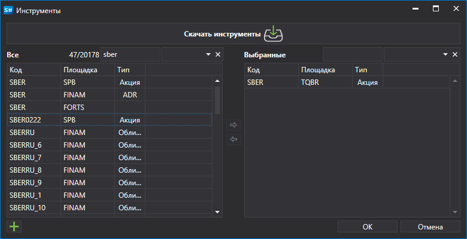

   Выбранные инструменты будут отображены в таблице **Инструменты**, которая представляет собой таблицу с древовидной структурой. Главным элементом которой является инструмент, дополнительным – типы маркет\-данных, которые будут получены для этого инструмента.
2. У каждого выбранного инструмента надо выбрать необходимые для скачивания типы маркет\-данных.

   Если не установлены все необходимые параметры инструмента, то в левой колонке строки с инструментом появится значок . 

   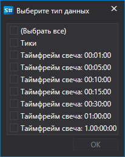

   Выберем скачать **Тики** и **Свечи Тайм Фрейм 5**.

   В нижней части окна источника расположена панель с кнопками для настройки получаемых данных и инструментов. 

   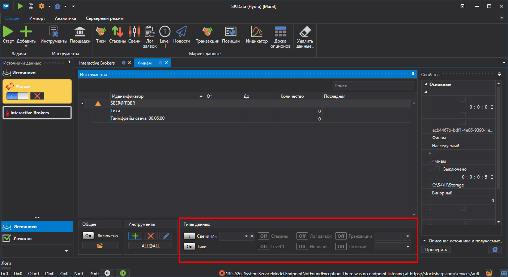

   С данной панели можно выполнить следующие операции:
   - Настроить объем получаемой информации при помощи кнопок: **Сделки**, **Стаканы**, **Свечи**, **Лог заявок**, **Level 1**, **Свои транзакции**. Для разных источников списки доступных типов маркет\-данных различаются. 
   - Указать необходимый Тайм Фрейм для загружаемых свечей. Для разных источников Тайм Фрейм получаемых свечей различаются.

     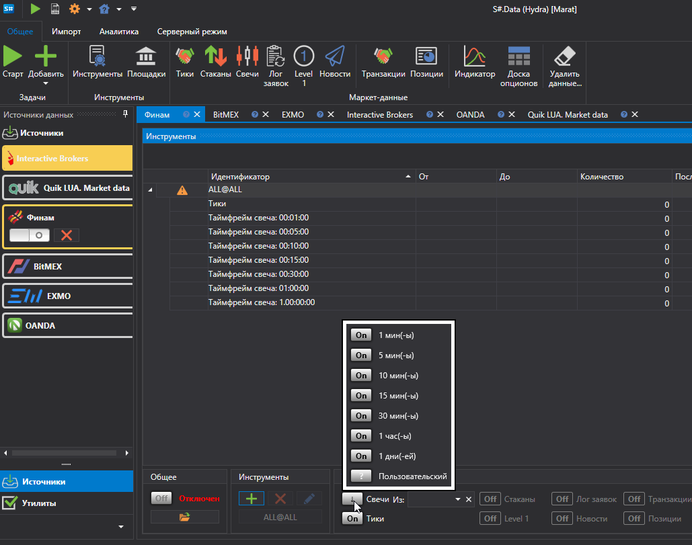
   - Выставить необходимый период для скачивания маркет\-данных. Так же период можно настроить непосредственно в окне маркет\-данных. Для этого необходимо выбрать начало и конец периода.

     Если пользователь не указывает дату окончания периода, то программа скачивает все доступные на текующую дату данные. Если источник поддерживает передачу маркет данных в режиме реального времени, то при отсутствии даты окончания периода, маркет\-данные будут скачиваться в режиме реального времени. 

     Установим период за который еобходимо скачать маркет\-данные.

     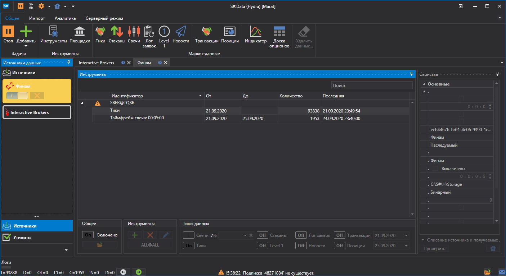
   - Указать из чего будут построены маркет\-данные. Если данный параметр не указывать, то будут получены свечи, имеющиеся в источнике. Если пользователь укажет тип маркет\-данных, то свечи будут построены из указанного типа маркет\-данных. Например, свечи могут быть построены из цены последней сделки, спрэда стакана (обычно для рынка Форекс), волатильности или лучшей цены.

     Данную функцию удобно применять, если источник не позволяет получить данные для построения свечи. В таком случае данные беруться по усредненным значениям и на основе этого строятся свечи.

     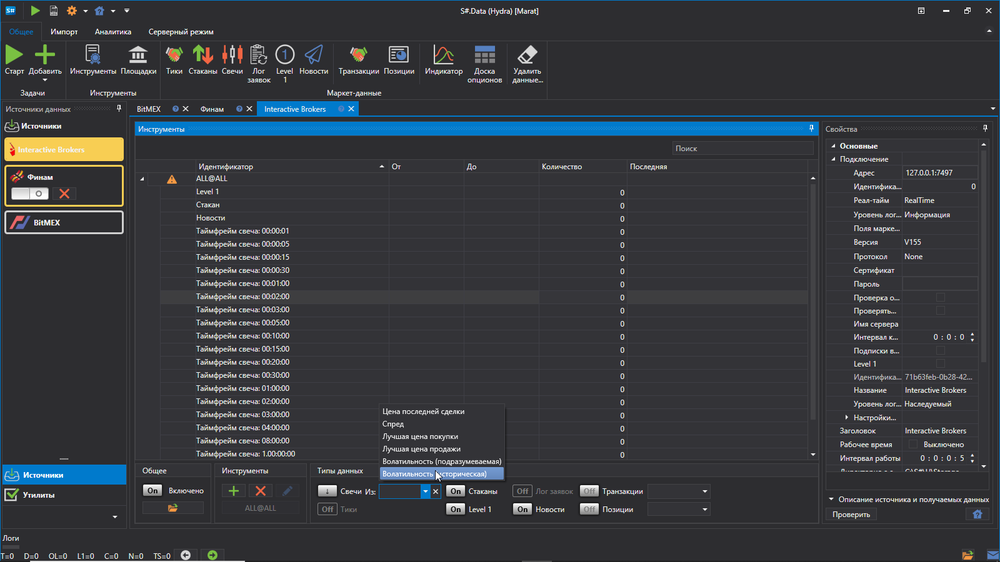

     Пользователь так же имеет возможность выбрать [Пользовательский](HydraCustomCandleType.md) тип свечей, для индивидуальной настройки получаемых данных.
   - После выбора инструмента, типа маркет\-данныx и настройки периода, необходимо нажать на кнопку **Старт**. После чего начнется скачивание маркет\-данных.

     Процесс работы можно наблюдать в специальной вкладке **Логи**, которая закреплена внизу программы. Кроме того, логи сохраняются в файлах в локальной директории. 

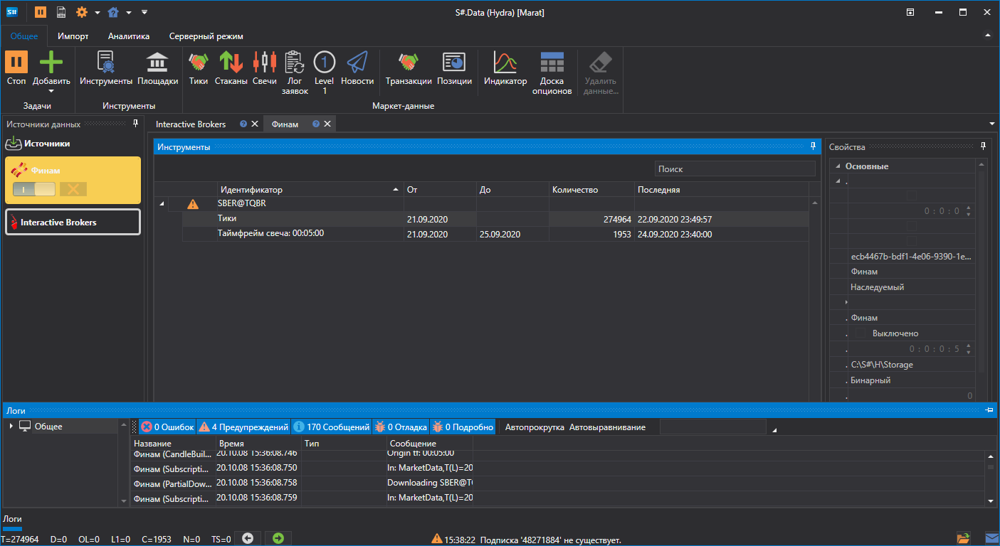

Также пользователь имеет возможность добавить [дополнительные источники](HydraSourceSelection.md).

После того как маркет\-данные будут скачены, пользователь может [просмотреть маркет данные](HydraViewingMarketData.md), [графически построить свечи](HydraCandles.md), сохранить или [экспортировать в различные форматы](HydraExport.md).

**Смотреть [видеоинструкцию](HydraFirstStartVideos.md)**
