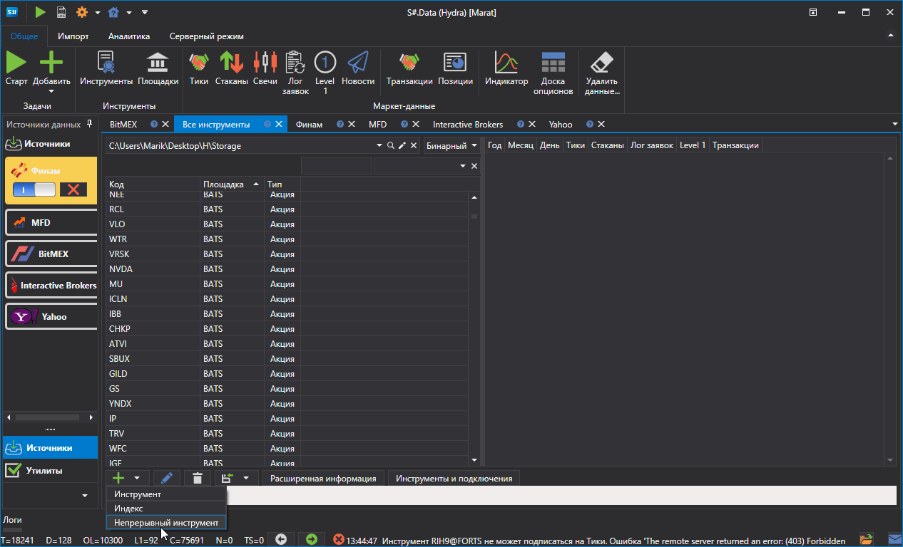
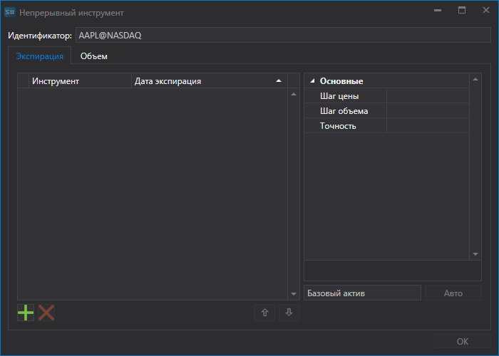
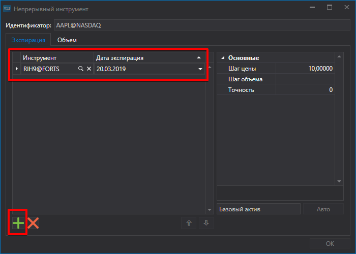
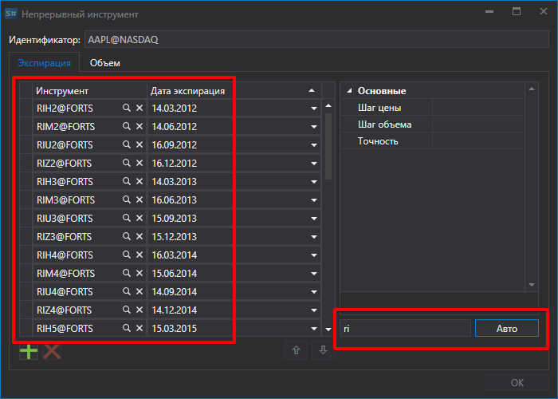
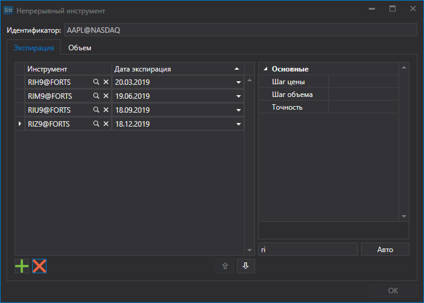
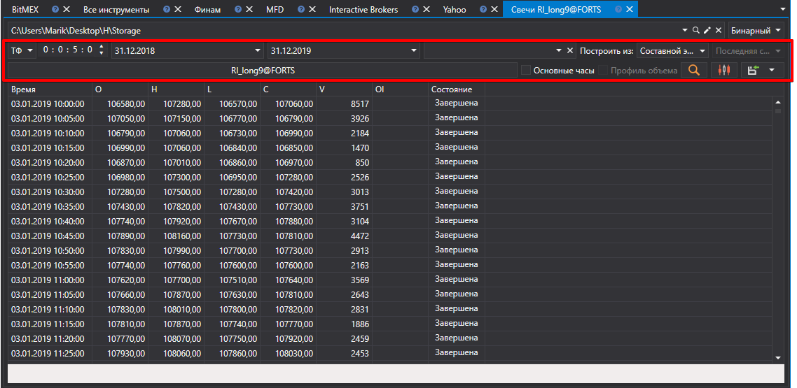

# Непрерывный фьючерс

Программа [S\#.Data](Hydra.md) позволяет пользователю возможность склеить различные виды маркет\-данных по разным контрактам в один непрерывный инструмент.

Для этого на вкладке **Общее** нужно выбрать **Инструменты**, появится вкладка **Все инструменты.**

Перед тем как склеивать данные, необходимо проверить, какие маркет\-данные есть. Для этого выбирается путь где лежат данные и по очереди просматриваются инструменты, которые предполагается склеить. Если имеются пропуски, то необходимо докачать нужные маркет\-данные(например, с **Финама**).

В качестве примера будет рассмотрено склеивание по фьючерсу на индекс RTS.

1. Для создания непрерывного фьючерса необходимо нажать на вкладке **Все инструменты.** кнопку **Создать инструмент\=\>Непрерывный инструмент**.

   После этого появится окно следующего вида:
2. Для создания непрерывного фьючерса необходимо задать имя и добавить контракты.

   Добавить контракты можно двумя способами.
   - Вручную, нажимая кнопку .
   - Если в качестве имени задать первые две буквы контракта, например, RI, и нажать кнопку **Авто**, то будут добавлены все найденные в БД инструменты.
3. Выбираем нужные контракты и устанавливаем даты перехода. 
4. Далее назначаем идентификатор инструмента **RI\_long9@FORTS** и нажать кнопку **ОК**, после чего создастся новый инструмент
5. Далее, необходимо нажать кнопку [Свечи](HydraExportCandles.md) на вкладке **Общее**, выбрать полученый инструмент, период данных, в поле **Построить из:** установить значение **Составной элемент**. После чего нажать кнопку.

Сгенерированные данные можно экспортировать в форматы Excel, xml, Json или txt. Экспорт выполняется при помощи раскрывающегося списка:

