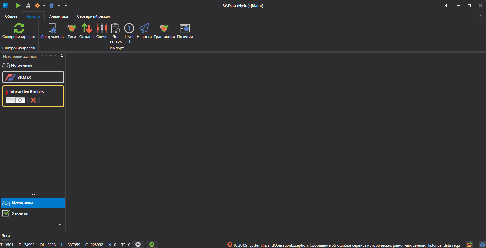

# Импорт данных

[S\#.Data](Hydra.md) позволяет выполнять импорт собственных данных, сохраненных в формате .csv. Для импорта нужно отрыть вкладку **Импорт**, и выбрать тип биржевых данных, который необходимо импортировать.

Можно импортировать следующие типы: 

- [Свечи](HydraImportCandles.md)
- [Инструменты](HydraImportSecurities.md)
- [Сделки](HydraImportTrades.md)
- [Стаканы](HydraImportDepths.md)
- [Лог заявок](HydraImportOrderlog.md)
- [Level 1](HydraImportLevel1.md)
- [Новости](HydraImportNews.md)
- [Свои транзакции](HydraImportExecutions.md)

**Смотреть [видеоинструкцию](HydraImportVideos.md)**
