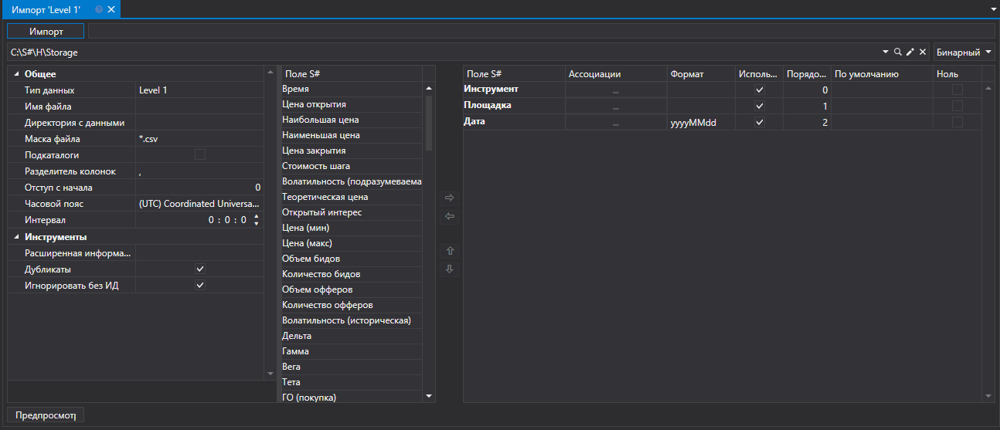
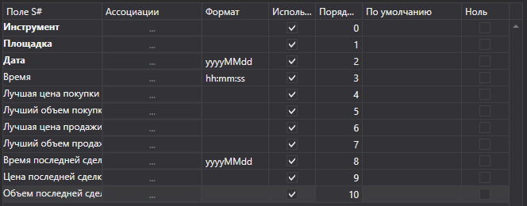
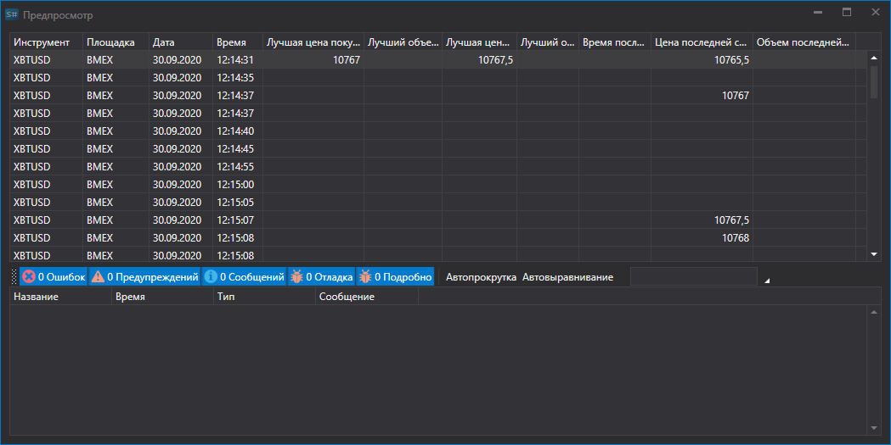

# Level 1

Для импорта данных Level 1 нужно выбрать пункт **Импорт \=\> Level 1** из главного меню приложения.



### Процесс импорта сделок

Процесс импорта сделок

1. **Настройки импорта**.

   См. импорт [Свечи](HydraImportCandles.md).
2. Настроить параметры импорта для полей [S\#](StockSharpAbout.md).

   См. импорт [Свечи](HydraImportCandles.md).

   **Рассмотрим пример импорта Лог заявок из CSV файла:**
   - Файл, данные из которого необходимо импортировать, имеет следующий шаблон записи:

     ```none
     {SecurityId.SecurityCode};{SecurityId.BoardCode};{ServerTime:default:yyyyMMdd};{ServerTime:default:HH:mm:ss.ffffff};{Changes:{BestBidPrice};{BestBidVolume};{BestAskPrice};{BestAskVolume};{LastTradeTime};{LastTradePrice};{LastTradeVolume}}
     	  				
     ```

     Здесь значение {SecurityId.SecurityCode} и {SecurityId.BoardCode}, соответсвуют значениям **Инструмент** и **Площадка** соответсвенно. Поэтому в поле **Порядок поля** мы присваиваем значение 0 и 1 соответсвенно.
   - Для полей {ServerTime:default:yyyyMMdd} и {ServerTime:default:HH:mm:ss.ffffff} выбираем из окна **Поле S\#** поля **Дата** и **Время** соответсвенно. Присваиваем значение 2 и 3.
   - Для поля {BestBidPrice} выбираем из окна **Поле S\#** поле **Лучшая цена покупки**. Присваиваем ему значение 4.
   - Для поля {BestBidVolume} выбираем из окна **Поле S\#** поле **Лучший объем покупки**. Присваиваем ему значение 5.
   - Для поля {BestAskPrice} выбираем из окна **Поле S\#** поле **Лучшая цена продажи**. Присваиваем ему значение 6.
   - Для поля {BestAskVolume} выбираем из окна **Поле S\#** поле **Лучшая объем продажи**. Присваиваем ему значение 7.
   - Для поля {LastTradeTime} выбираем из окна **Поле S\#** поле **Время последней сделки**. Присваиваем ему значение 8.
   - Для поля {LastTradePrice} выбираем из окна **Поле S\#** поле **Цена последней сделки**. Присваиваем ему значение 9.
   - Для поля {LastTradeVolume} выбираем из окна **Поле S\#** поле **Объем последней сделки**. Присваиваем ему значение 10.
   - Окно настройки полей будет выглядить следующим образом:

   Пользователь может настроить большое количество свойств для скачиваемых данных. Исходя из шаблона импортируемого файла, нужно указывать свойство и присваивать ему нужный номер в последовательности. 
3. Для преварительного просмотра данных, нажать кнопку **Предпросмотр**.
4. Для преварительного просмотра данных, нажать кнопку **Предпросмотр**.
5. Нажать кнопку **Импорт**.
