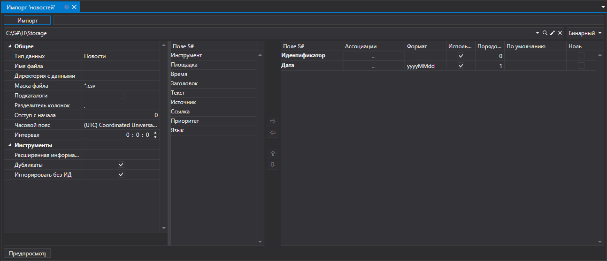

# Новости

Для импорта новостей нужно выбрать пункт **Импорт \=\> Новости** из главного меню приложения.

## Процесс импорта новостей

1. Выполнить **Настройки импорта из CSV**.

   См. импорт [Свечи](HydraImportCandles.md).
2. Настроить параметры импорта для полей [S\#](StockSharpAbout.md).

   См. импорт [Свечи](HydraImportCandles.md).
3. Для преварительного просмотра данных, нажать кнопку **Предпросмотр**.
4. Нажать кнопку **Импорт**.
