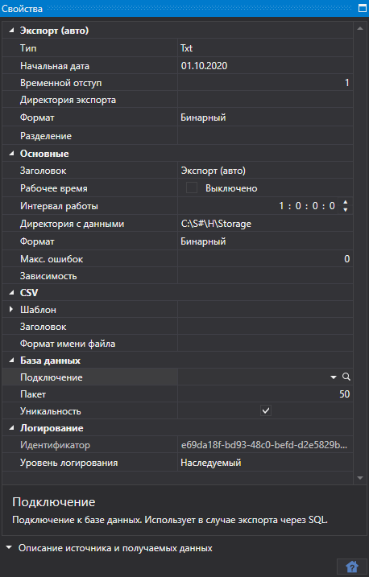
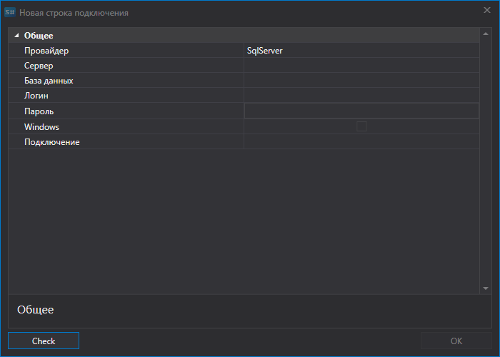
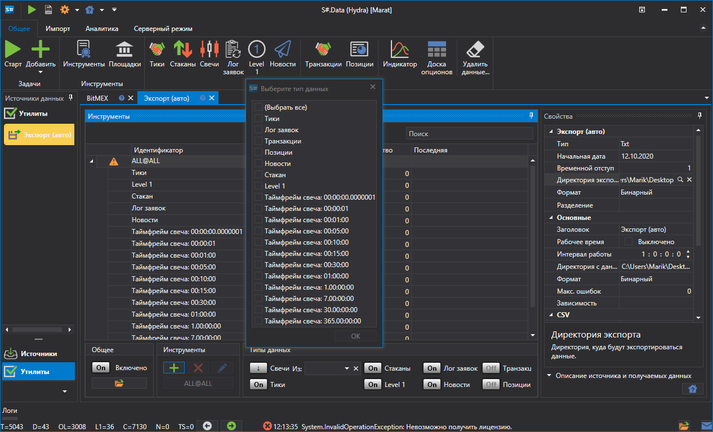
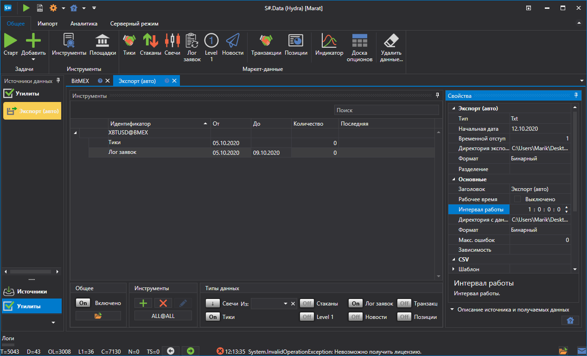
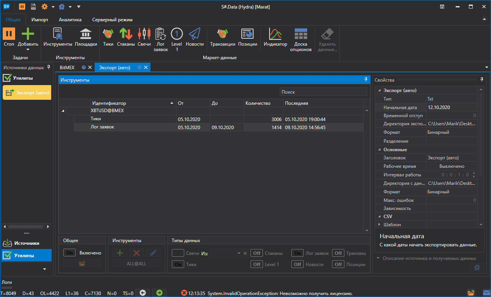
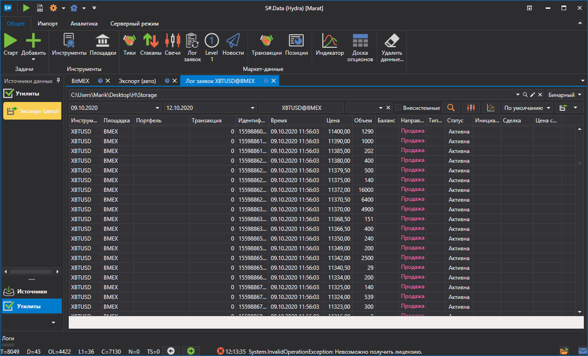

# Экспорт (авто)

Задача выполняет экспорт биржевых данных в различные форматы: Excel, xml, sql, bin, Json или txt.

**База данных**

- **Подключение** \- подключение в базе данных. Используется в случае экспорта через SQL. 
- **Пакет** \- размер пакета передаваемых данных. По умолчанию равен 50 элементам. Используется в случае экспорта через SQL. 
- **Уникальность** \- проверять уникальность данных в базе данных. Влияет на производительность. По умолчанию включено. Используется в случае экспорта через SQL. 

> [!TIP]
> При использовании экспорта через SQL нужно установить параметры строки подключения

**Новая строка подключения**

- **Провайдер** \- настройки провайдера. 
- **Сервер** \- адрес сервера или путь к база данных. 
- **База данных** \- название базы данных. Не используется для SQLite. 
- **Логин** \- логин для доступа к базе данных. Не используется при анонимном доступе. 
- **Пароль** \- пароль для доступа к базе данных. Не используется при анонимном доступе. 
- **Windows** \- использовать текущую учетную запись Windows для подключения к базе данных. 
- **Подключение** \- готовая строка подключения. 

> [!TIP]
> Проверить соединение с базой можно при помощи кнопки "Проверить".

**Основные**

- **Заголовок** \- название задачи. 
- **Рабочее время** \- настройка работы площадки. 
- **Интервал работы** \- интервал работы. 
- **Директория с данными** \- директория с данными, куда будут сохраняться конечные файлы в формате [S\#](StockSharpAbout.md). 
- **Формат** \- формат данных: BIN\/CSV. 
- **Макс. ошибок** \- максимальное количество ошибок, по достижению которого задача будет остановлена. По умолчанию 0 \- количество ошибок игнорируется. 
- **Зависимость** \- задача, которая должна быть выполнена перед запуском текущей. 

**CSV**

- **Шаблоны** \- шаблоны для каждого типа экспортируемых данных. 
- **Заголовок** \- заголовок индущий первой строкой. Если передается пустая строка, то заголовок не будет добавлен в файл. 
- **Формат имени** \- формат записи имени экспортируемого файла. 

**Экспорт (авто)**

- **Тип** \- тип экспорта (формат). 
- **Начальная дата** \- с какой даты начать экспортировать данные. 
- **Временной отступ** \- временной отступ в днях. 
- **Директория экспорта** \- директория, куда будут экспортироваться данные. 
- **Формат** \- формат данных. 
- **Разделение** \- тип разделения. 

**Логирование**

- **Идентификатор** \- идентификатор. 
- **Уровень логирования** \- уровень логирования. 

Рассморим пример автоматического экспорта:

1. Выбираем инструмент.
2. Устанавливаем маркет данные которые необходимо экспортировать.
3. Устанавливаем период экспорта. Если настроено скачивание маркет данных в режиме реального времени, то можно не указывать дату окончания периода. В таком случае данные будут экспортироваться в режиме реального времени, в соответствии с интервалом работы (обновления данных). 
4. Настраиваем директории. Интервал работы. Тип данных. Формат данных.
5. Запускаем экспорт.

Просмотрим экспортированные данные.

**Смотреть [видеоинструкцию](HydraExportAutoVideo.md)**
