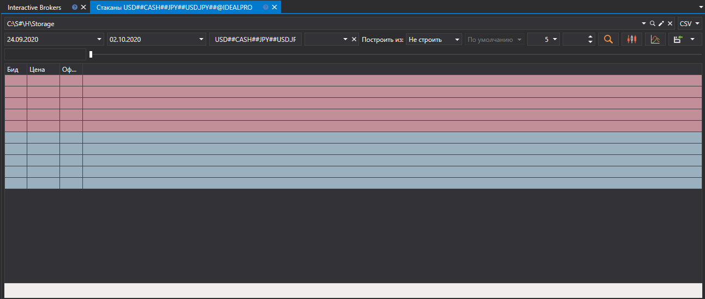
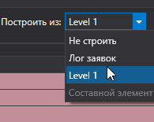
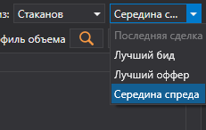
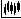
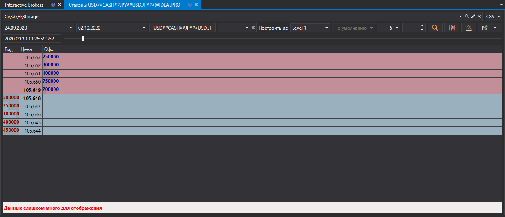

# Использование маркет данных различного типа

[S\#.Data](Hydra.md) позволяет использовать для получения ряда маркет\-данных данные другого типа.

Это необходимо если источник не позволяет скачать нужные маркет\-данные. Так например для построения **Стакана** можно использовать сразу несколько типов маркет\-данных.

ВАЖНО\!**Стакан** можно построить из **Лога заявок** или **Level 1** Level1 при условии, что данные типы данных содержат лучшие цены.

Стоит помнить, что занчения **Level 1** можно скачать с любого источника, котрый выдает маркет\-данные в реальном времени. **Level 1** так же можно получить путем [конвертации](HydraTasksConverter.md) из **Стакана**. 

Для построения нужно:

1. Выбрать период и инструмент, для которого необходимо получить маркет\-данные.

   
2. Выбрать поле **Построить из** и выбрать нужный тип данных.

   

   ВАЖНО\! Если для построения свечи в качестве источника выбираются **Стакан**, **Лог заявок**, **Level 1**, появляется возможность выбора дополнительных параметров.

   
3. После настройки нужно нажать на кнопку .

   

Для построения **Свечей** так же доступен вариант построения свечей большего Тайм Фрейма из свечей меньшего Тайм Фрейма. 

Так например если имются свечи с Тайм Фреймом 1 минута, из них можно построить свечи с Тайм Фреймом 5 минут, выбрав соответственный тип в строке **Построить из**. 

**Смотреть [видеоинструкцию](HydraBuildMarkethDepthLogLevel.md)**
