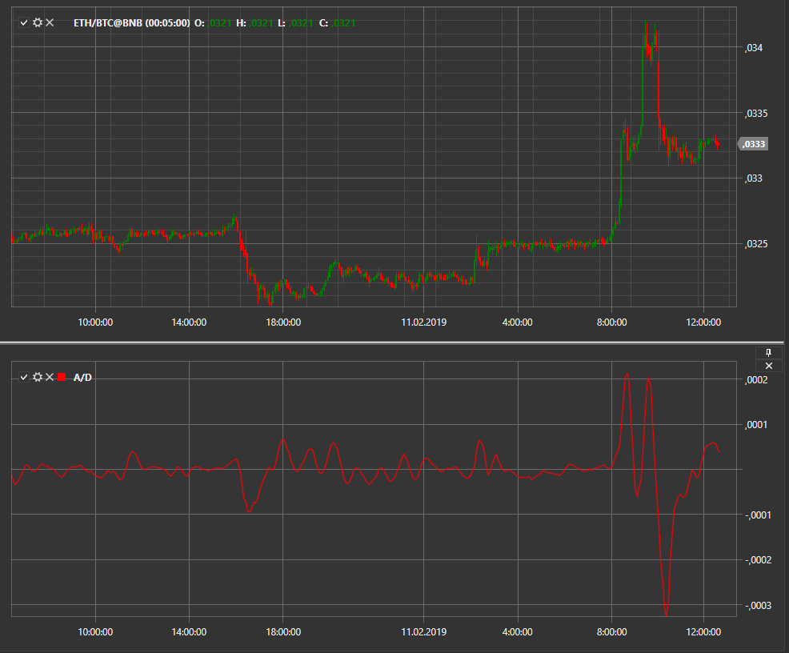

# A\/C

**Замедления\/Ускорения (Acceleration\/Deceleration , A\/C)** является осциллятором, который был создан Биллом Уильямсом. Он измеряет ускорение и замедление импульса тренда.

Для использования индикатора необходимо использовать класс [Acceleration](../api/StockSharp.Algo.Indicators.Acceleration.html). 

## См. также

[Alligator](IndicatorAlligator.md)
