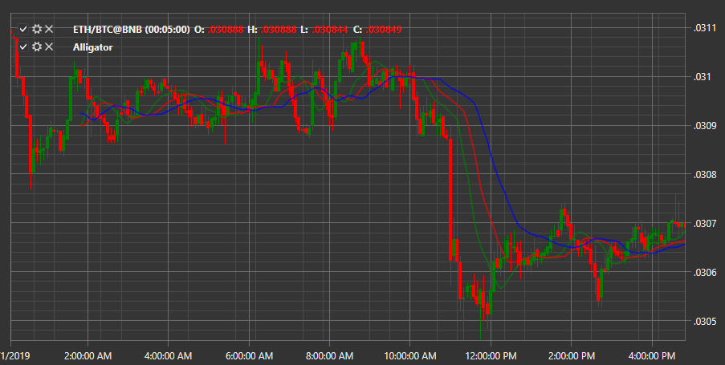

# Alligator

Индикатор **Аллигатор (Alligator)** представляет из себя группу индикаторов из трех скользящих средних. Эти скользящие средние имеют разный период, а также сдвинуты вперед на графике. 

Для использования индикатора необходимо использовать класс [Alligator](../api/StockSharp.Algo.Indicators.Alligator.html). 

## См. также

[ADX](IndicatorAverageDirectionalIndex.md)
