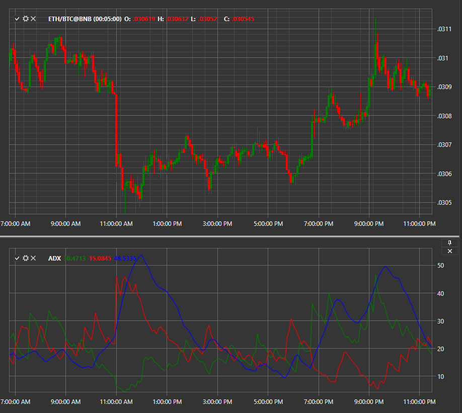

# ADX

**Индекс среднего направленного движения (Welles Wilder's ADX, Average Directional Index)** представляет из себя группу индикаторов направленного движения. Линии составляют индекс направленного движения (DMI): ADX , DI+ и DI\-. ADX указывает на силу тренда, DI+ и DI\- указывают на текущее направление цены. 

Для использования индикатора необходимо использовать класс [AverageDirectionalIndex](../api/StockSharp.Algo.Indicators.AverageDirectionalIndex.html). 

## См. также

[ATR](IndicatorAverageTrueRange.md)
