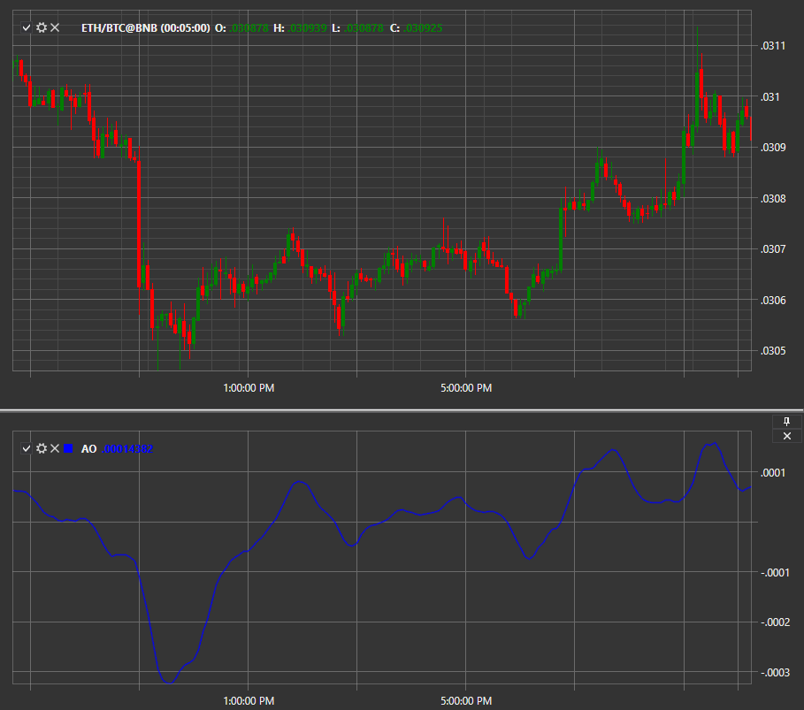

# AO

Индикатор **Чудесный Осциллятор (Awesome Oscillator, AO)** – классический технический индикатор, построенный посредством вычитания скользящих средних (SMA) с разными периодами. 

Для использования индикатора необходимо использовать класс [AwesomeOscillator](xref:StockSharp.Algo.Indicators.AwesomeOscillator). 
##### Расчет

Гистограмма Awesome Oscillator представляет собой 34-периодное простое скользящее среднее, которое построено по центральным значениям баров (H+L) \/ 2, вычтенное из 5-периодного простого скользящего среднего по центральным точкам (Н+L) \/ 2. Таким образом, медленная скользящая средняя линия вычитается из быстрой, чтобы можно было получить представление о силе движения цены и её дальнейших намерениях.  

MEDIAN PRICE = (HIGH + LOW) \/ 2  
AO = SMA (MEDIAN PRICE, 5) \– SMA (MEDIAN PRICE, 34), где  
  
MEDIAN PRICE — медианная цена  
HIGH — максимальная цена бара  
LOW — минимальная цена бара  
SMA — простая скользящая средняя

Значения взяты для классического индикатора, в настройках всегда можно указать свои собственные параметры.

## См. также

[Bollinger Bands](IndicatorBollingerBands.md)
