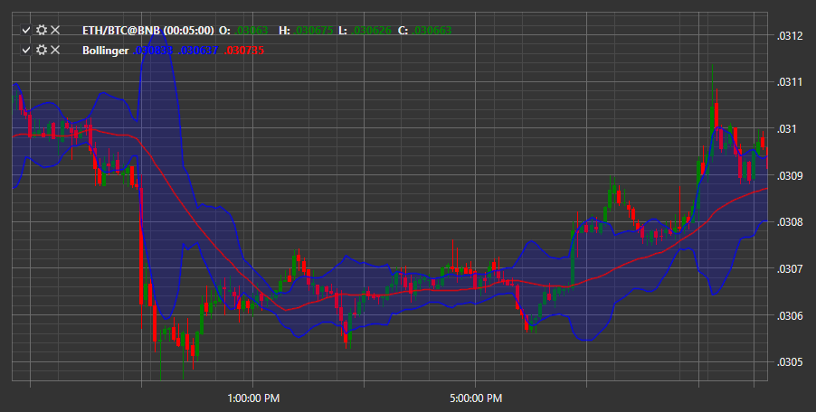

# Bollinger Bands

**Полосы Боллинджера (Bollinger Bands)** – осциллирующий индикатор, который используется для измерения волатильности рынка. Он позволяет оценить, является ли цена высокой или низкой по сравнению со скользящим средним. Центральная полоса соответствует простому скользящему среднему цены. Верхняя и нижняя полосы являются уровнями, на которых цена может считаться высокой или низкой по отношению к скользящему среднему. 

Для использования индикатора необходимо использовать класс [BollingerBands](../api/StockSharp.Algo.Indicators.BollingerBands.html). 

## См. также

[CHV](IndicatorChaikinVolatility.md)
