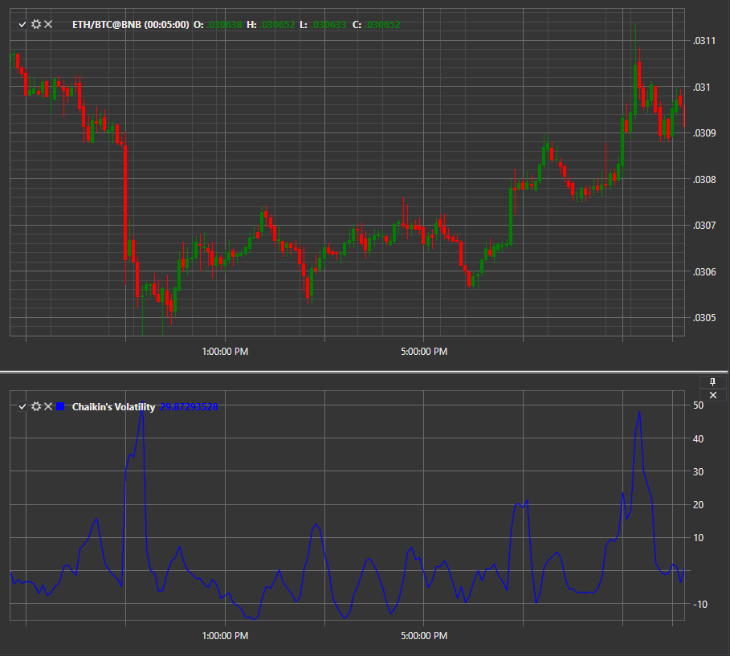

# CHV

**Волатильность Чайкина (Chaikin Volatility, CHV)** указывает разницу между максимумом покупки и минимумом продажи за один промежуток времени. При помощи индикатора можно проводить качественный анализ изменения цены и ширины диапазона между ценовым максимумом и минимумом. CHV не учитывает в расчете ценовые разрывы, что в определенной мере можно считать его недостатком. 

Для использования индикатора необходимо использовать класс [ChaikinVolatility](xref:StockSharp.Algo.Indicators.ChaikinVolatility). 
##### Расчет

Расчет индикатора волатильности Чайкина начинается с определения спрэда \– разницы между максимумом и минимумом текущего бара. Полученный результат сглаживается экспоненциальной скользящей средней за соответствующий период. Волатильность рассчитывается по формуле:

CHV = (EMA (H\-L (i), n) \– EMA (H\-L (i\–n), n)) / EMA (H\-L (i\–n), n) x 100.

В данном случае H\-L (i) представляет собой разницу цен на текущем баре, а H\-L (i\–n) \– разница цен на баре, случившемся n-периодами раньше. Таким образом, мы имеем возможность наглядно видеть, как менялась цена со временем.

Основные параметры индикатора:

- **ROCPeriod** – номер периода, относительно которого будет проводиться расчет. Изначально установлено значение 5.
- **SmoothPeriod** – период скользящей средней. По умолчанию здесь стоит 32.

## См. также

[CMO](IndicatorChandeMomentumOscillator.md)
