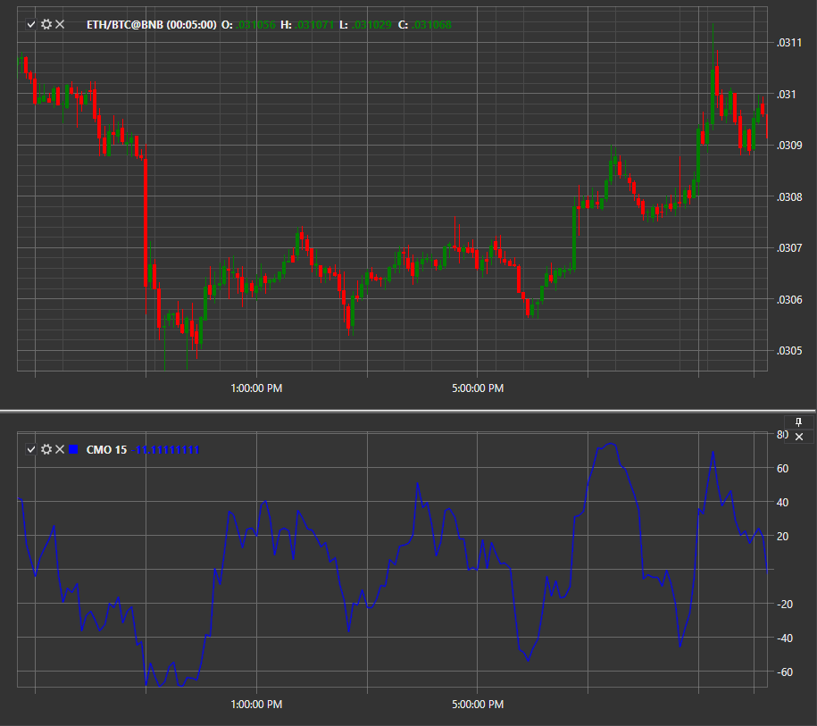

# CMO

**Осциллятор ценовых моментов Чанде (Chande Momentum Oscillator, CMO)** – модификация индикатора Momentum, изобретателем которой является трейдер Тушар Чанде (Tushar Chande). 

Для использования индикатора необходимо использовать класс [ChandeMomentumOscillator](../api/StockSharp.Algo.Indicators.ChandeMomentumOscillator.html). 

## См. также

[CCI](IndicatorCommodityChannelIndex.md)
