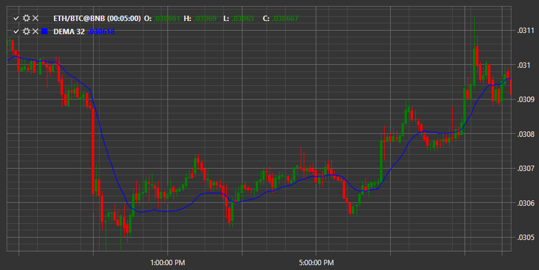

# DEMA

**Двойная экспоненциальная скользящая средняя (DEMA)** – использует множественные (двойные) экспоненциальные скользящие средние (EMA), чтобы устранить лаги при прогнозировании цен. 

Для использования индикатора необходимо использовать класс [DoubleExponentialMovingAverage](xref:StockSharp.Algo.Indicators.DoubleExponentialMovingAverage). 

## См. также

[Envelope](IndicatorEnvelope.md)
