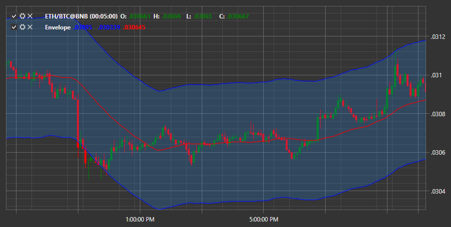

# Envelope

**Envelope** индикатор, который является каналом, созданный путем смещения скользящей средней на определенное значение. 

Для использования индикатора необходимо использовать класс [Envelope](xref:StockSharp.Algo.Indicators.Envelope). 

## См. также

[EMA](IndicatorExponentialMovingAverage.md)
