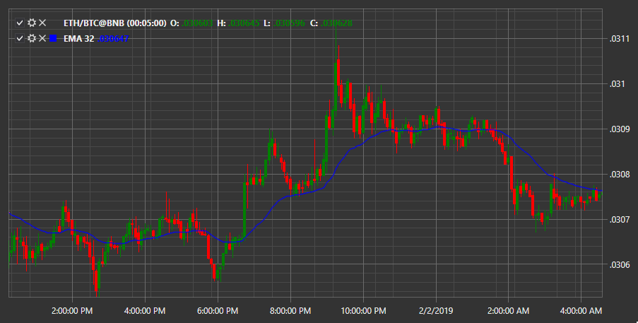

# EMA

**Экспоненциальное скользящее среднее (Exponential Moving Average, EMA)** \- это тип скользящего среднего (MA), который придает больший вес и значимость самым последним данным. 

Для использования индикатора необходимо использовать класс [ExponentialMovingAverage](xref:StockSharp.Algo.Indicators.ExponentialMovingAverage). 

## См. также

[Fractals](IndicatorFractals.md)
