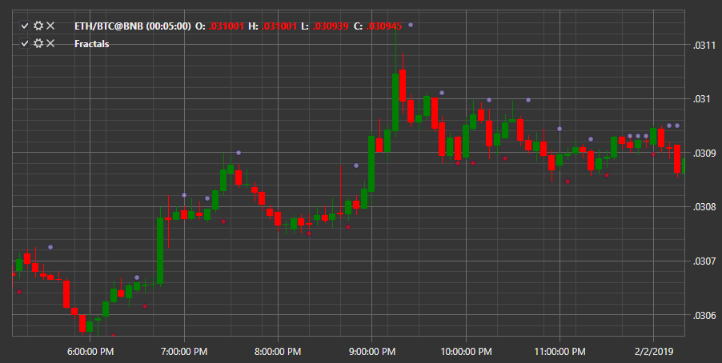

# Fractals

**Фрактал (Fractals)** – это последовательность из нескольких свечей, максимум (минимум) центральной из которых находится выше максимумов (минимумов) соседних.

Для использования индикатора необходимо использовать класс [Fractals](xref:StockSharp.Algo.Indicators.Fractals). 

## См. также

[Gator Oscillator](IndicatorGatorOscillator.md)
