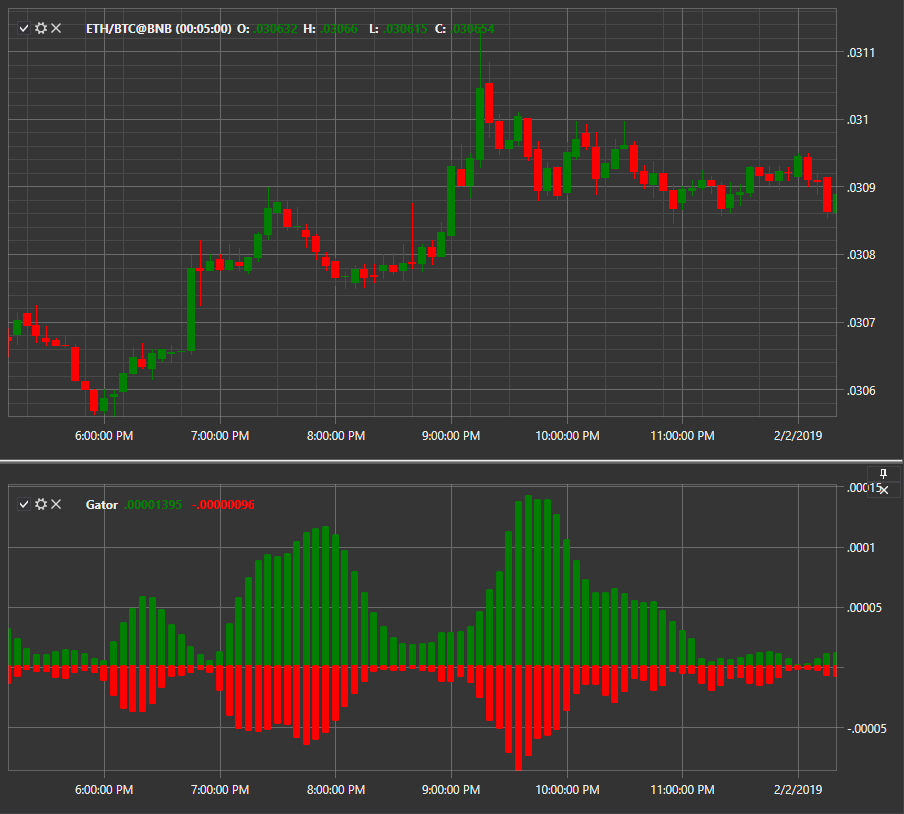

# Gator Oscillator

**Gator Oscillator** – осциллятор разработанный Биллом Уильямсом. Он тесно связан с аналогичным индикатором Аллигатора. Как индикатор тренда, он наиболее полезен на рынках, которые демонстрируют сильное направленное действие. 

Для использования индикатора необходимо использовать класс [GatorOscillator](xref:StockSharp.Algo.Indicators.GatorOscillator). 

## См. также

[Highest ](IndicatorHighest.md)
