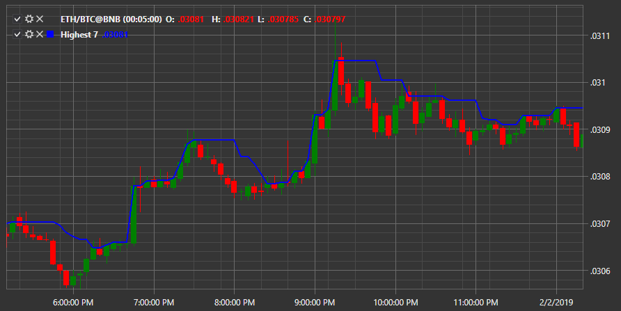

# Highest 

Индикатор **Максимальное значение за период** указывает на максимальное значение за период. 

Для использования индикатора необходимо использовать класс [Highest](../api/StockSharp.Algo.Indicators.Highest.html). 

## См. также

[HMA](IndicatorHullMovingAverage.md)
