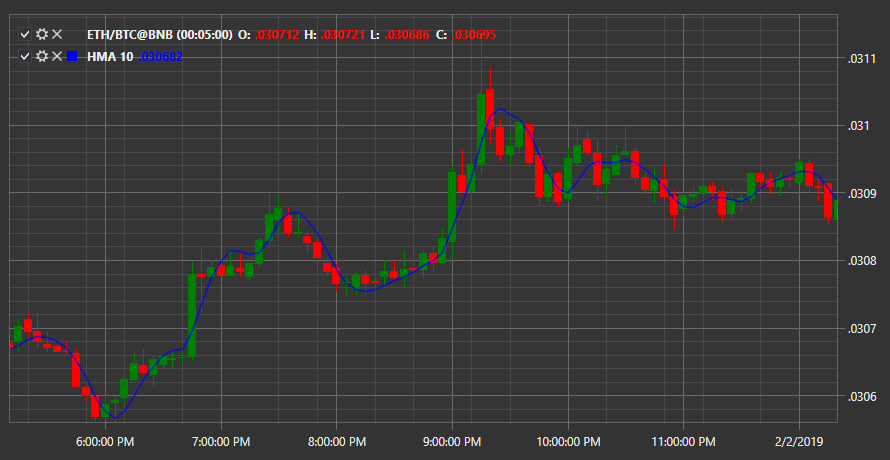

# HMA

**Скользящая средняя Халла (Hull Moving Average, HMA)** \- индикатор показывает направление рыночного тренда и представляет собой усовершенствованную скользящую среднюю. 

Для использования индикатора необходимо использовать класс [HullMovingAverage](xref:StockSharp.Algo.Indicators.HullMovingAverage). 

## См. также

[Ichimoku](IndicatorIchimoku.md)
