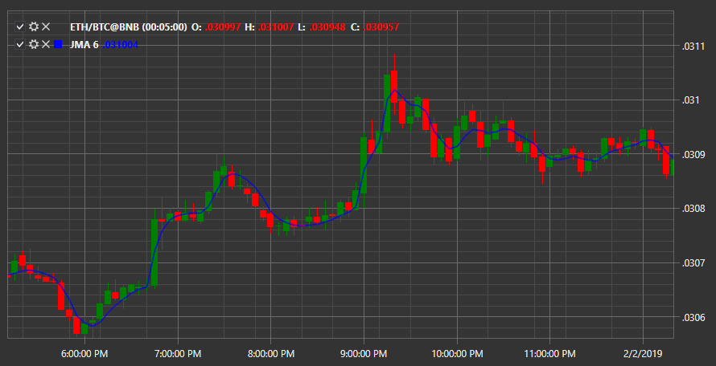

# JMA

**Скользящее среднее Юрика (англ. Jurik’s Moving Average, JMA)** – индикатор является разновидностью скользящего среднего. Кривой индикатора свойственно хорошее сглаживание, а также минимальное опережение после окончания ценовых движений и минимальное отставание от сильных движений цены. 

Для использования индикатора необходимо использовать класс [JurikMovingAverage](xref:StockSharp.Algo.Indicators.JurikMovingAverage). 

##### Настройки индикатора.

- Фаза \- определяет скорость с которой будет разворачиваться скользящая средняя;
- Период \- определяет период скользящей средней.

## См. также

[KAMA](IndicatorKaufmannAdaptiveMovingAverage.md)
