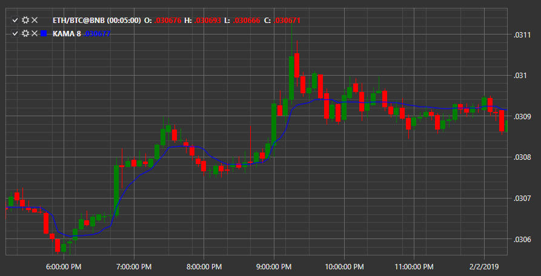

# KAMA

**Адаптивная скользящая средняя Кауфмана (AMA, KAMA, AMkA, Kaufman's Adaptive Moving Average)** — был разработан Перри Кауфманом для учета шума и волатильности на рынке. Индикатор KAMA можно использовать для определения точек разворота во времени, определения общего тренда и фильтрации ценовых движений. 

Для использования индикатора необходимо использовать класс [KaufmannAdaptiveMovingAverage](xref:StockSharp.Algo.Indicators.KaufmannAdaptiveMovingAverage). 

## См. также

[KAMA](IndicatorKaufmannAdaptiveMovingAverage.md)
