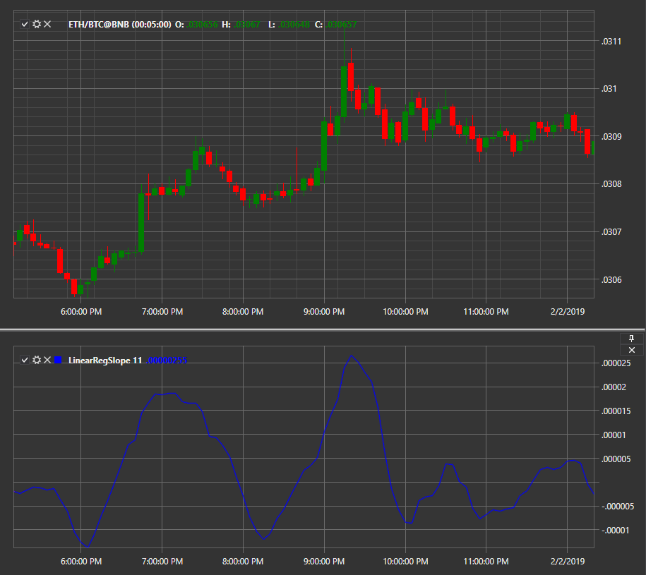

# Linear Regression Slope

Интерпретация индикатора **Linear Regression Slope** показывает значение наклона линий регрессии, которые включают текущий ценовой бар и предыдущий n\-1 ценовой бар (где n \= периоды регрессии). 

Для использования индикатора необходимо использовать класс [LinearRegSlope](../api/StockSharp.Algo.Indicators.LinearRegSlope.html). 

## См. также

[Логирование](Logging.md)
