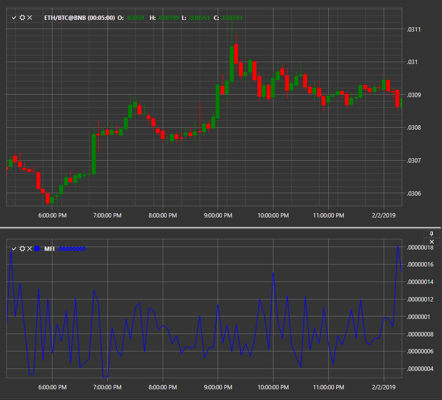

# Market Facilitation Index

**Индекс Облегчения Рынка (Market Facilitation Index, MFI)** — индикатор, который оценивает готовность рынка двигать цену. Абсолютные значения индикатора не могут дать никаких торговых сигналов, в отличие от его динамики по отношению к динамике объема. 

Для использования индикатора необходимо использовать класс [MarketFacilitationIndex](xref:StockSharp.Algo.Indicators.MarketFacilitationIndex). 

## См. также

[Mean Deviation](IndicatorMeanDeviation.md)
