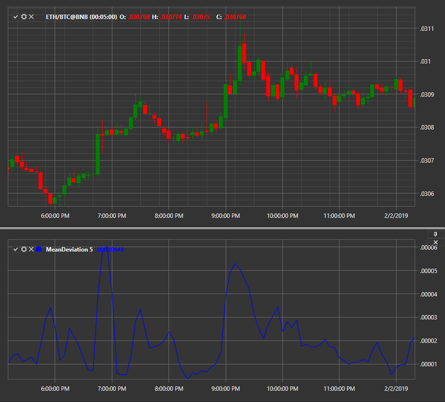

# Mean Deviation

Индикатор **Среднее отклонение (Mean Deviation)** показывает среднее отклонение за период. 

Для использования индикатора необходимо использовать класс [MeanDeviation](../api/StockSharp.Algo.Indicators.MeanDeviation.html). 

## См. также

[Median Price](IndicatorMedianPrice.md)
