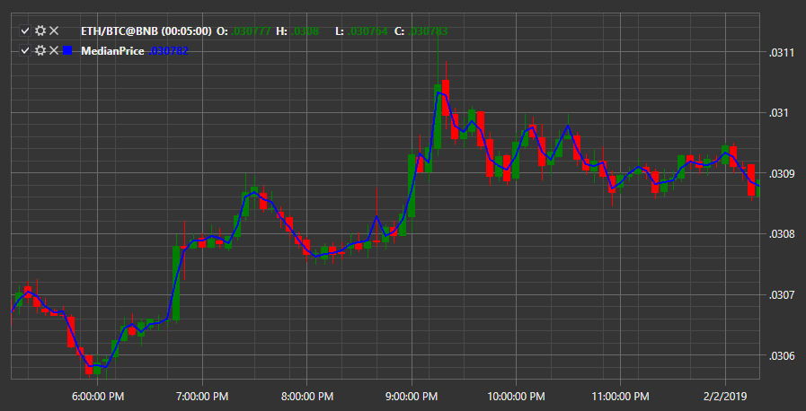

# Median Price

Индикатор **Медианная цена (Median Price)** показывает медианную цену для свечи. 

Для использования индикатора необходимо использовать класс [MedianPrice](xref:StockSharp.Algo.Indicators.MedianPrice). 

## См. также

[Momentum](IndicatorMomentum.md)
