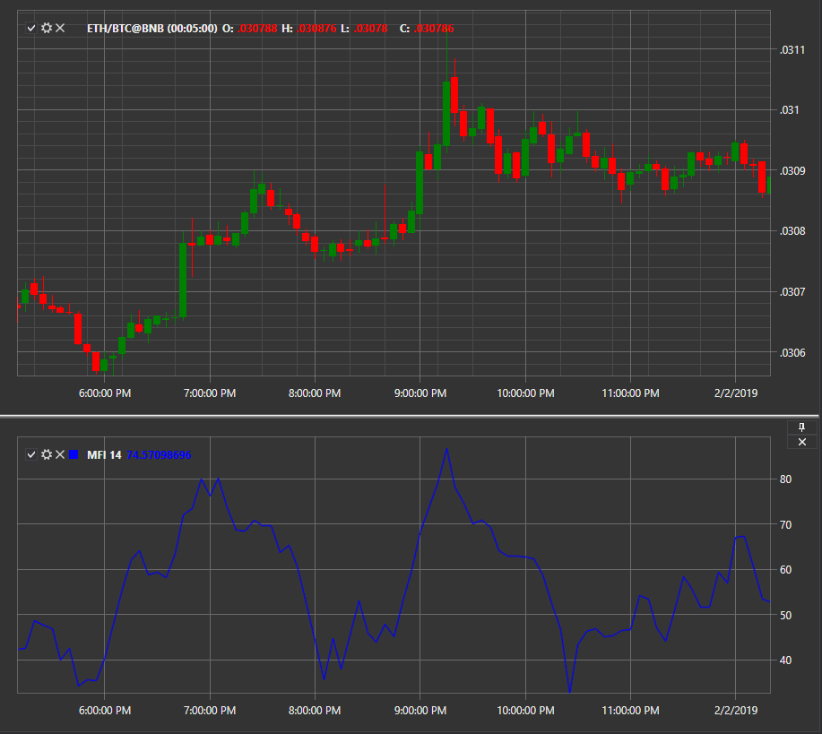

# Money Flow Index

**Индекс денежного потока (Money Flow Index, MFI)** — высчитывает разность входящих и исходящих денежных потоков. Если базовая стоимость актива оказывается ниже разности, это говорит об увеличении входящей денежной массы, то есть рынок бычий. Если наблюдается обратное, значит, инвесторы уходят из инструмента, рынок медвежий.  
Индикатор представляет собой технический осциллятор для определения условий перекупленности или перепроданности в активе. Его также можно использовать для определения расхождений, которые предупреждают об изменении тренда в цене. Осциллятор движется между 0 и 100.

Для использования индикатора необходимо использовать класс [MoneyFlowIndex](xref:StockSharp.Algo.Indicators.MoneyFlowIndex). 

## См. также

[MACD](IndicatorMovingAverageConvergenceDivergence.md)
